# 📦 LÓGICA COMPLETA DO SISTEMA DE PEDIDOS - DASHBOARD 4LIFE
## Guia para IA Lovable - Implementação do Menu Pedidos

---

## 🎯 *VISÃO GERAL DO SISTEMA*

O sistema de pedidos do Dashboard 4Life é o *núcleo central* da aplicação, responsável por gerenciar todo o ciclo de vida dos pedidos desde a captação até a entrega. Este documento detalha *toda a lógica* para que a IA Lovable possa replicar fielmente o sistema.

---

## 🧬 *ESTRUTURA DE DADOS FUNDAMENTAIS*

### *1. Campo REC - A Chave do Sistema*
```javascript
// CRITICAL: O campo 'rec' determina ONDE o pedido aparece
const logicaRec = {
  'rec = true':  'Página RECUPERAÇÃO (vendas perdidas/abandonadas)',
  'rec = false': 'Página PEDIDOS (pedidos normais)',
  'rec = null':  'Página PEDIDOS (pedidos normais - padrão)'
}
```

### *2. Estrutura Completa do Pedido*
```json
{
  "id": "uuid-gerado-automaticamente",
  "numero_pedido": "pedido_1704067200000", // timestamp único
  "nome_cliente": "Maria Silva",
  "telefone_cliente": "(11) 99999-9999",
  "email_cliente": "maria@email.com",
  "problema_relatado": "Dores nas articulações há 3 meses",
  "pacote_escolhido": "Pacote Premium - R$ 397",
  "valor_final": 397.00, // OBRIGATÓRIO - NOT NULL
  "status": "pendente", // pendente|em_andamento|finalizado|cancelado
  "origem": "whatsapp", // site|whatsapp|facebook|instagram|telefone
  "rec": false, // CAMPO CRÍTICO - define a página
  "observacoes": "Cliente interessado, aguardando confirmação",
  "dias_processamento": 0,
  "criado_em": "2025-01-01T10:00:00Z",
  "atualizado_em": "2025-01-01T10:00:00Z"
}
```

---

## 🔄 *FLUXO COMPLETO DE DADOS*

### *1. Origem dos Dados*

```mermaid
graph TD
    A[Formulário Site] --> B[Arquivo JSON]
    C[WhatsApp] --> B
    D[Facebook] --> B
    E[Instagram] --> B
    F[Telefone] --> B
    B --> G[Processamento PHP]
    G --> H[Validação]
    H --> I[Supabase Database]
    I --> J[Interface Dashboard]
```


### *2. Estrutura de Arquivos JSON (Origem)*

```
2025/pedidos/
├── pedido_1704067200000.json      # Pedido normal (sem rec)
├── pedido_1704153600000.json      # Pedido normal (rec: false)
├── pedido_1704240000000.json      # Recuperação (rec: true)
├── ws_1704326400000_abc123.json   # WhatsApp
├── fb_1704412800000_def456.json   # Facebook
└── index.json                     # Índice de controle
```

### *3. Exemplo de Arquivo JSON Original*
```json
{
  "nome": "João Santos",
  "contato": "(21) 98765-4321",
  "problema": "Insônia crônica",
  "data": "2025-01-01",
  "hora": "14:30",
  "origem": "whatsapp",
  "rec": false,  // ← CAMPO CRÍTICO
  "valor": "297.00",
  "produtos": ["Magnésio", "Melatonina"],
  "observacoes": "Cliente já tentou outros tratamentos"
}
```

---

## ⚙️ *FUNÇÕES PRINCIPAIS DO SISTEMA*

### *1. Função: getPedidosSupabase() - NÚCLEO PRINCIPAL*

*Propósito*: Buscar pedidos para a página principal (exclui recuperação)
*Local*: dashboard/pedidos_supabase.php

```php
function getPedidosSupabase($filtros = []) {
    $client = getSupabaseClient();
    
    // FILTRO PRINCIPAL - Excluir recuperação
    if (!isset($filtros['rec'])) {
        // Por padrão: rec=false OU rec=null (pedidos normais)
        $options['or'] = '(rec.eq.false,rec.is.null)';
    }
    
    // Aplicar filtros adicionais
    if (!empty($filtros['status'])) {
        $supabase_filters['status'] = $filtros['status'];
    }
    
    if (!empty($filtros['busca'])) {
        $busca = $filtros['busca'];
        $options['and'] = "rec.neq.true,(numero_pedido.ilike.*$busca*,problema_relatado.ilike.*$busca*)";
    }
    
    return $client->get('pedidos', $supabase_filters, $options);
}
```

*Equivalente Next.js*:
```javascript
// lib/supabase/pedidos.js
export async function getPedidos(filtros = {}) {
  let query = supabase
    .from('pedidos')
    .select('*')
  
  // FILTRO PRINCIPAL - Excluir recuperação (rec=true)
  if (!filtros.incluir_recuperacao) {
    query = query.or('rec.eq.false,rec.is.null')
  }
  
  // Filtros adicionais
  if (filtros.status) {
    query = query.eq('status', filtros.status)
  }
  
  if (filtros.busca) {
    query = query.or(`
      numero_pedido.ilike.%${filtros.busca}%,
      nome_cliente.ilike.%${filtros.busca}%,
      problema_relatado.ilike.%${filtros.busca}%
    `)
  }
  
  return query.order('criado_em', { ascending: false })
}
```

### *2. Função: getRecuperacaoSupabase() - PÁGINA RECUPERAÇÃO*

*Propósito*: Buscar APENAS pedidos de recuperação (rec=true)
*Local*: dashboard/pedidos_supabase.php

```php
function getRecuperacaoSupabase($filtros = []) {
    $client = getSupabaseClient();
    
    // FILTRO ESPECÍFICO - Apenas recuperação
    $filtros['rec'] = ['eq', 'true'];
    
    return $client->get('pedidos', $filtros, [
        'order' => 'criado_em.desc',
        'limit' => '1000'
    ]);
}
```

*Equivalente Next.js*:
```javascript
export async function getRecuperacao(filtros = {}) {
  let query = supabase
    .from('pedidos')
    .select('*')
    .eq('rec', true)  // APENAS rec=true
  
  if (filtros.busca) {
    query = query.or(`
      numero_pedido.ilike.%${filtros.busca}%,
      nome_cliente.ilike.%${filtros.busca}%
    `)
  }
  
  return query.order('criado_em', { ascending: false })
}
```

### *3. Função: Processar Pedido - LÓGICA COMPLEXA*

*Propósito*: Processar ações no pedido (aprovar, enviar, cancelar)
*Local*: dashboard/processar_pedido.php

```php
// LÓGICA DE PROCESSAMENTO
function processarPedido($arquivo) {
    // 1. CARREGAR DADOS DO JSON
    $pedido_path = "../2025/pedidos/$arquivo";
    $dados = json_decode(file_get_contents($pedido_path), true);
    
    // 2. VALIDAR STATUS ATUAL
    $status_permitidos = ['pendente', 'em_andamento'];
    if (!in_array($dados['status'], $status_permitidos)) {
        return ['success' => false, 'error' => 'Status não permite processamento'];
    }
    
    // 3. APLICAR NOVA AÇÃO
    switch ($_POST['acao']) {
        case 'aprovar':
            $dados['status'] = 'em_andamento';
            $dados['data_aprovacao'] = date('Y-m-d H:i:s');
            break;
            
        case 'enviar':
            $dados['status'] = 'finalizado';
            $dados['codigo_rastreio'] = $_POST['codigo_rastreio'];
            $dados['data_envio'] = date('Y-m-d H:i:s');
            // INTEGRAÇÃO TRELLO
            integrarComTrello($dados, $_POST['codigo_rastreio']);
            break;
            
        case 'cancelar':
            $dados['status'] = 'cancelado';
            $dados['motivo_cancelamento'] = $_POST['motivo'];
            break;
    }
    
    // 4. SALVAR ALTERAÇÕES
    file_put_contents($pedido_path, json_encode($dados, JSON_PRETTY_PRINT));
    
    // 5. ATUALIZAR ÍNDICE
    atualizarIndice($dados, $arquivo);
    
    // 6. SINCRONIZAR COM SUPABASE
    sincronizarComSupabase($dados);
    
    return ['success' => true, 'pedido' => $dados];
}
```

*Equivalente Next.js*:
```javascript
export async function processarPedido(id, acao, dados = {}) {
  try {
    const updates = {
      atualizado_em: new Date().toISOString()
    }
    
    switch (acao) {
      case 'aprovar':
        updates.status = 'em_andamento'
        updates.data_aprovacao = new Date().toISOString()
        break
        
      case 'enviar':
        updates.status = 'finalizado'
        updates.codigo_rastreio = dados.codigo_rastreio
        updates.data_envio = new Date().toISOString()
        // Integrar com sistema de tracking
        await integrarComSistemaRastreio(dados.codigo_rastreio)
        break
        
      case 'cancelar':
        updates.status = 'cancelado'
        updates.motivo_cancelamento = dados.motivo
        break
        
      case 'mover_para_recuperacao':
        updates.rec = true
        updates.status = 'recuperacao'
        break
    }
    
    const { data, error } = await supabase
      .from('pedidos')
      .update(updates)
      .eq('id', id)
      .select()
    
    if (error) throw error
    return { success: true, data: data[0] }
  } catch (error) {
    return { success: false, error: error.message }
  }
}
```

### *4. Função: Remover Pedido - EXCLUSÃO SEGURA*

*Propósito*: Mover pedido para lixeira (não deletar fisicamente)
*Local*: dashboard/remover_pedido.php

```php
function removerPedido($arquivo, $nome, $pedido_id) {
    // 1. VERIFICAR PERMISSÕES
    $nivel_acesso = $_SESSION['nivel_acesso'];
    if (!in_array($nivel_acesso, ['logistica', 'vendas', 'admin'])) {
        return ['success' => false, 'error' => 'Permissão negada'];
    }
    
    // 2. CARREGAR DADOS ATUAIS
    $pedido_path = "../2025/pedidos/$arquivo";
    $dados = json_decode(file_get_contents($pedido_path), true);
    
    // 3. MARCAR COMO DELETADO (não remover arquivo)
    $dados['status'] = 'deletado';
    $dados['is_recuperacao'] = true; // Move para lixeira
    $dados['data_remocao'] = date('Y-m-d H:i:s');
    $dados['removido_por'] = $_SESSION['usuario_id'];
    
    // 4. SALVAR ESTADO DE LIXEIRA
    file_put_contents($pedido_path, json_encode($dados, JSON_PRETTY_PRINT));
    
    // 5. ATUALIZAR SUPABASE
    $supabase_data = [
        'status' => 'deletado',
        'rec' => true, // Move para área de recuperação/lixeira
        'atualizado_em' => date('c')
    ];
    
    $client = getSupabaseClient();
    $client->patch('pedidos', ['id' => ['eq', $pedido_id]], $supabase_data);
    
    // 6. REMOVER DO ÍNDICE PRINCIPAL
    removerDoIndice($arquivo);
    
    return ['success' => true, 'message' => 'Pedido movido para lixeira'];
}
```

*Equivalente Next.js*:
```javascript
export async function removerPedido(id) {
  try {
    // Soft delete - mover para lixeira
    const { data, error } = await supabase
      .from('pedidos')
      .update({
        status: 'deletado',
        rec: true, // Move para área de lixeira
        data_remocao: new Date().toISOString(),
        atualizado_em: new Date().toISOString()
      })
      .eq('id', id)
      .select()
    
    if (error) throw error
    
    return { success: true, data: data[0] }
  } catch (error) {
    return { success: false, error: error.message }
  }
}
```

---

## 📊 *SISTEMA DE FILTROS E BUSCA*

### *1. Filtros Principais*
```javascript
const filtrosPedidos = {
  // Status do pedido
  status: ['pendente', 'em_andamento', 'finalizado', 'cancelado', 'deletado'],
  
  // Origem do pedido
  origem: ['site', 'whatsapp', 'facebook', 'instagram', 'telefone', 'manual'],
  
  // Tipo de página (CRÍTICO)
  rec: {
    false: 'Página Pedidos',
    true: 'Página Recuperação',
    null: 'Página Pedidos (padrão)'
  },
  
  // Filtros de data
  data_inicio: '2025-01-01',
  data_fim: '2025-12-31',
  
  // Busca textual
  busca: 'termo de busca'
}
```

### *2. Implementação de Busca Avançada*
```javascript
export function construirFiltros(filtros) {
  let query = supabase.from('pedidos').select('*')
  
  // FILTRO REC (sempre aplicar primeiro)
  if (filtros.pagina === 'pedidos') {
    query = query.or('rec.eq.false,rec.is.null')
  } else if (filtros.pagina === 'recuperacao') {
    query = query.eq('rec', true)
  }
  
  // Filtros de status
  if (filtros.status) {
    query = query.eq('status', filtros.status)
  }
  
  // Busca textual (combinar múltiplos campos)
  if (filtros.busca) {
    const termoBusca = `%${filtros.busca}%`
    query = query.or(`
      numero_pedido.ilike.${termoBusca},
      nome_cliente.ilike.${termoBusca},
      telefone_cliente.ilike.${termoBusca},
      problema_relatado.ilike.${termoBusca},
      observacoes.ilike.${termoBusca}
    `)
  }
  
  // Filtros de data
  if (filtros.data_inicio) {
    query = query.gte('criado_em', filtros.data_inicio)
  }
  if (filtros.data_fim) {
    query = query.lte('criado_em', filtros.data_fim)
  }
  
  // Ordenação padrão
  query = query.order('criado_em', { ascending: false })
  
  return query
}
```

---

## 🎨 *INTERFACE DO USUÁRIO - COMPONENTES*

### *1. Card de Pedido - Componente Principal*
```jsx
// components/PedidoCard.jsx
export default function PedidoCard({ pedido, onProcessar, onRemover, onEditar }) {
  const getStatusColor = (status) => {
    const cores = {
      'pendente': 'bg-yellow-100 text-yellow-800',
      'em_andamento': 'bg-blue-100 text-blue-800',
      'finalizado': 'bg-green-100 text-green-800',
      'cancelado': 'bg-red-100 text-red-800'
    }
    return cores[status] || 'bg-gray-100 text-gray-800'
  }
  
  return (
    <div className="bg-white rounded-lg shadow-md p-6 border-l-4 border-blue-500">
      {/* Header com Status */}
      <div className="flex justify-between items-start mb-4">
        <h3 className="text-lg font-semibold text-gray-900">
          {pedido.nome_cliente}
        </h3>
        <span className={`px-3 py-1 rounded-full text-sm font-medium ${getStatusColor(pedido.status)}`}>
          {pedido.status.charAt(0).toUpperCase() + pedido.status.slice(1)}
        </span>
      </div>
      
      {/* Informações Principais */}
      <div className="space-y-2 text-sm text-gray-600">
        <div className="flex">
          <span className="font-medium w-24">Pedido:</span>
          <span>{pedido.numero_pedido}</span>
        </div>
        <div className="flex">
          <span className="font-medium w-24">Telefone:</span>
          <span>{pedido.telefone_cliente}</span>
        </div>
        <div className="flex">
          <span className="font-medium w-24">Valor:</span>
          <span className="font-semibold text-green-600">
            R$ {parseFloat(pedido.valor_final).toFixed(2)}
          </span>
        </div>
        <div className="flex">
          <span className="font-medium w-24">Origem:</span>
          <span className="capitalize">{pedido.origem}</span>
        </div>
      </div>
      
      {/* Problema Relatado */}
      <div className="mt-4">
        <span className="font-medium text-sm text-gray-700">Problema:</span>
        <p className="text-sm text-gray-600 mt-1">
          {pedido.problema_relatado || 'Não informado'}
        </p>
      </div>
      
      {/* Observações */}
      {pedido.observacoes && (
        <div className="mt-3">
          <span className="font-medium text-sm text-gray-700">Observações:</span>
          <p className="text-sm text-gray-600 mt-1">{pedido.observacoes}</p>
        </div>
      )}
      
      {/* Ações */}
      <div className="flex gap-2 mt-6">
        <button 
          onClick={() => onProcessar(pedido)}
          className="bg-blue-600 hover:bg-blue-700 text-white px-4 py-2 rounded-lg text-sm font-medium transition-colors"
        >
          Processar
        </button>
        <button 
          onClick={() => onEditar(pedido)}
          className="bg-gray-600 hover:bg-gray-700 text-white px-4 py-2 rounded-lg text-sm font-medium transition-colors"
        >
          Editar
        </button>
        <button 
          onClick={() => onRemover(pedido.id)}
          className="bg-red-600 hover:bg-red-700 text-white px-4 py-2 rounded-lg text-sm font-medium transition-colors"
        >
          Remover
        </button>
      </div>
      
      {/* Indicador REC */}
      <div className="mt-2 text-xs text-gray-400">
        Tipo: {pedido.rec ? 'Recuperação' : 'Pedido Normal'}
      </div>
    </div>
  )
}
```

### *2. Sistema de Filtros - Interface*
```jsx
// components/FiltrosPedidos.jsx
export default function FiltrosPedidos({ filtros, onFiltrosChange }) {
  return (
    <div className="bg-white p-6 rounded-lg shadow-sm mb-6">
      <h3 className="text-lg font-medium mb-4">Filtros</h3>
      
      <div className="grid grid-cols-1 md:grid-cols-4 gap-4">
        {/* Busca */}
        <div>
          <label className="block text-sm font-medium text-gray-700 mb-2">
            Buscar
          </label>
          <input
            type="text"
            placeholder="Nome, telefone, número..."
            value={filtros.busca || ''}
            onChange={(e) => onFiltrosChange({ ...filtros, busca: e.target.value })}
            className="w-full px-3 py-2 border border-gray-300 rounded-lg focus:ring-2 focus:ring-blue-500 focus:border-transparent"
          />
        </div>
        
        {/* Status */}
        <div>
          <label className="block text-sm font-medium text-gray-700 mb-2">
            Status
          </label>
          <select
            value={filtros.status || ''}
            onChange={(e) => onFiltrosChange({ ...filtros, status: e.target.value })}
            className="w-full px-3 py-2 border border-gray-300 rounded-lg focus:ring-2 focus:ring-blue-500"
          >
            <option value="">Todos</option>
            <option value="pendente">Pendente</option>
            <option value="em_andamento">Em Andamento</option>
            <option value="finalizado">Finalizado</option>
            <option value="cancelado">Cancelado</option>
          </select>
        </div>
        
        {/* Origem */}
        <div>
          <label className="block text-sm font-medium text-gray-700 mb-2">
            Origem
          </label>
          <select
            value={filtros.origem || ''}
            onChange={(e) => onFiltrosChange({ ...filtros, origem: e.target.value })}
            className="w-full px-3 py-2 border border-gray-300 rounded-lg focus:ring-2 focus:ring-blue-500"
          >
            <option value="">Todas</option>
            <option value="site">Site</option>
            <option value="whatsapp">WhatsApp</option>
            <option value="facebook">Facebook</option>
            <option value="instagram">Instagram</option>
            <option value="telefone">Telefone</option>
          </select>
        </div>
        
        {/* Data */}
        <div>
          <label className="block text-sm font-medium text-gray-700 mb-2">
            Data Início
          </label>
          <input
            type="date"
            value={filtros.data_inicio || ''}
            onChange={(e) => onFiltrosChange({ ...filtros, data_inicio: e.target.value })}
            className="w-full px-3 py-2 border border-gray-300 rounded-lg focus:ring-2 focus:ring-blue-500"
          />
        </div>
      </div>
      
      {/* Limpar Filtros */}
      <div className="mt-4">
        <button
          onClick={() => onFiltrosChange({})}
          className="text-sm text-gray-500 hover:text-gray-700"
        >
          Limpar todos os filtros
        </button>
      </div>
    </div>
  )
}
```

---

## 🚀 *PÁGINA PRINCIPAL - IMPLEMENTAÇÃO COMPLETA*

### *app/pedidos/page.jsx*
```jsx
'use client'
import { useState, useEffect } from 'react'
import { getPedidos } from '@/lib/supabase/pedidos'
import PedidoCard from '@/components/PedidoCard'
import FiltrosPedidos from '@/components/FiltrosPedidos'
import Loading from '@/components/Loading'
import { toast } from 'react-hot-toast'

export default function PedidosPage() {
  const [pedidos, setPedidos] = useState([])
  const [loading, setLoading] = useState(true)
  const [filtros, setFiltros] = useState({})
  
  const carregarPedidos = async () => {
    try {
      setLoading(true)
      const { data, error } = await getPedidos(filtros)
      
      if (error) {
        toast.error('Erro ao carregar pedidos')
        return
      }
      
      setPedidos(data || [])
    } catch (error) {
      toast.error('Erro na conexão')
    } finally {
      setLoading(false)
    }
  }
  
  useEffect(() => {
    carregarPedidos()
  }, [filtros])
  
  const handleProcessar = (pedido) => {
    // Abrir modal de processamento
    console.log('Processar pedido:', pedido.id)
  }
  
  const handleEditar = (pedido) => {
    // Abrir modal de edição
    console.log('Editar pedido:', pedido.id)
  }
  
  const handleRemover = async (id) => {
    if (!confirm('Tem certeza que deseja remover este pedido?')) return
    
    try {
      // Implementar remoção
      toast.success('Pedido removido com sucesso')
      carregarPedidos()
    } catch (error) {
      toast.error('Erro ao remover pedido')
    }
  }
  
  if (loading) return <Loading />
  
  return (
    <div className="space-y-6">
      {/* Header */}
      <div className="flex justify-between items-center">
        <div>
          <h1 className="text-2xl font-bold text-gray-900">Pedidos</h1>
          <p className="text-gray-600">
            {pedidos.length} pedidos encontrados
          </p>
        </div>
        
        <button 
          onClick={() => window.location.href = '/pedidos/novo'}
          className="bg-blue-600 hover:bg-blue-700 text-white px-4 py-2 rounded-lg font-medium"
        >
          Novo Pedido
        </button>
      </div>
      
      {/* Filtros */}
      <FiltrosPedidos 
        filtros={filtros}
        onFiltrosChange={setFiltros}
      />
      
      {/* Lista de Pedidos */}
      <div className="grid gap-6">
        {pedidos.length === 0 ? (
          <div className="text-center py-12">
            <p className="text-gray-500">Nenhum pedido encontrado</p>
          </div>
        ) : (
          pedidos.map(pedido => (
            <PedidoCard
              key={pedido.id}
              pedido={pedido}
              onProcessar={handleProcessar}
              onEditar={handleEditar}
              onRemover={handleRemover}
            />
          ))
        )}
      </div>
    </div>
  )
}
```

---

## 🎯 *PONTOS CRÍTICOS PARA A IA LOVABLE*

### *1. CAMPO REC - NUNCA ESQUECER*
```javascript
// ❌ ERRO - Vai misturar pedidos e recuperação
const query = supabase.from('pedidos').select('*')

// ✅ CORRETO - Sempre filtrar por rec
const query = supabase
  .from('pedidos')
  .select('*')
  .or('rec.eq.false,rec.is.null') // Excluir rec=true
```

### *2. VALIDAÇÃO OBRIGATÓRIA*
```javascript
// valor_final é obrigatório (NOT NULL)
const validarPedido = (dados) => {
  if (!dados.nome_cliente) {
    throw new Error('Nome do cliente é obrigatório')
  }
  if (!dados.valor_final || parseFloat(dados.valor_final) <= 0) {
    throw new Error('Valor final é obrigatório e deve ser maior que zero')
  }
  // Outros campos opcionais...
}
```

### *3. SEMPRE INCLUIR TIMESTAMPS*
```javascript
const criarPedido = async (dados) => {
  const pedido = {
    ...dados,
    criado_em: new Date().toISOString(),
    atualizado_em: new Date().toISOString()
  }
  
  return supabase.from('pedidos').insert([pedido])
}
```

### *4. SOFT DELETE - NUNCA DELETAR FISICAMENTE*
```javascript
// ❌ ERRO - Delete físico
await supabase.from('pedidos').delete().eq('id', id)

// ✅ CORRETO - Soft delete
await supabase
  .from('pedidos')
  .update({ 
    status: 'deletado',
    rec: true, // Move para lixeira
    data_remocao: new Date().toISOString()
  })
  .eq('id', id)
```

---

## 📋 *CHECKLIST DE IMPLEMENTAÇÃO*

### *Fase 1: Estrutura Base*
- [ ] Configurar Supabase client
- [ ] Criar tabela pedidos com campo rec
- [ ] Implementar funções básicas (get, create, update)
- [ ] Testar filtro rec (crítico)

### *Fase 2: Interface*
- [ ] Componente PedidoCard
- [ ] Sistema de filtros
- [ ] Página principal de pedidos
- [ ] Loading states

### *Fase 3: Funcionalidades*
- [ ] Criar novo pedido
- [ ] Editar pedido existente
- [ ] Processar pedido (status)
- [ ] Remover pedido (soft delete)

### *Fase 4: Integração*
- [ ] Sistema de busca avançada
- [ ] Paginação
- [ ] Exportação de dados
- [ ] Métricas e relatórios

---

*🎯 Esta documentação contém TODA a lógica necessária para que a IA Lovable implemente fielmente o sistema de pedidos, preservando todas as regras de negócio e funcionalidades do sistema PHP original.*