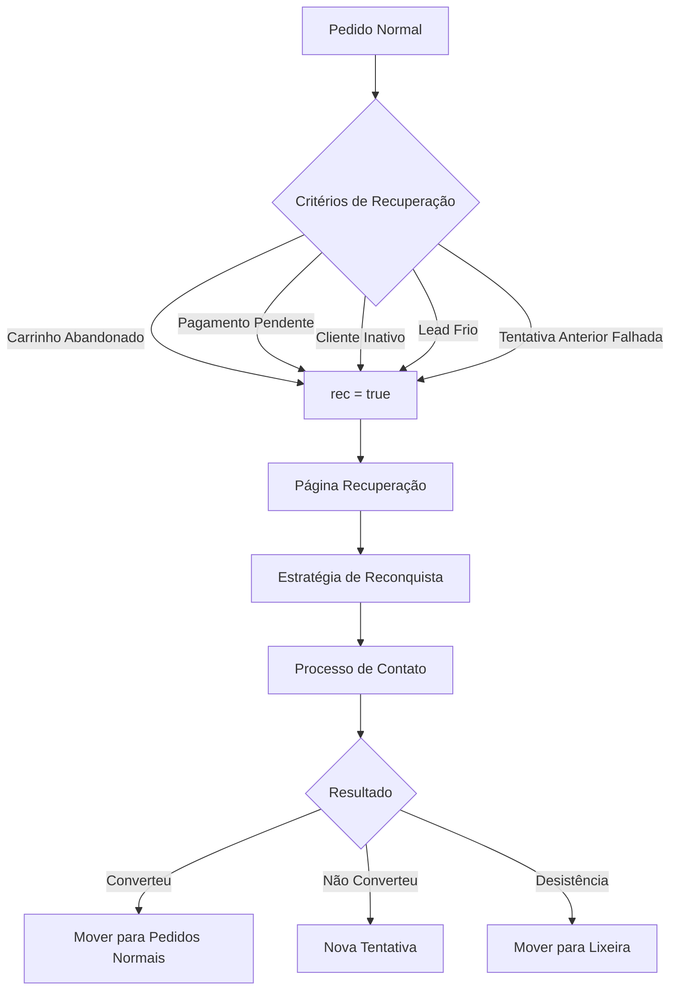

# 🔄 LÓGICA COMPLETA DO SISTEMA DE RECUPERAÇÃO DE PEDIDOS - DASHBOARD 4LIFE
## Guia para IA Lovable - Implementação do Menu Recuperação

---

## 🎯 **VISÃO GERAL DO SISTEMA DE RECUPERAÇÃO**

O Sistema de Recuperação de Pedidos é uma **funcionalidade estratégica** do Dashboard 4Life, focada em **resgatar vendas perdidas** e **reativar clientes inativos**. Este sistema identifica, processa e converte pedidos abandonados ou problemáticos em oportunidades de venda.

### **Objetivo Principal**
- **Recuperar pedidos abandonados** (carrinho abandonado, pagamento não concluído)
- **Reativar clientes inativos** (sem compras há X dias)
- **Processar leads frios** (interessados que não compraram)
- **Gerenciar campanhas de reconquista**

---

## 🧬 **ESTRUTURA DE DADOS - SISTEMA REC**

### **1. Campo REC - Coração da Recuperação**
```javascript
// CRITICAL: O campo 'rec' é o diferencial do sistema
const logicaRecuperacao = {
  'rec = true':  'PÁGINA RECUPERAÇÃO - Pedidos para recuperar',
  'rec = false': 'PÁGINA PEDIDOS - Pedidos normais',
  'rec = null':  'PÁGINA PEDIDOS - Pedidos normais (padrão)'
}

// Estados do sistema de recuperação
const estadosRecuperacao = {
  'leads_frios': 'Clientes que demonstraram interesse mas não compraram',
  'carrinho_abandonado': 'Adicionaram produtos mas não finalizaram',
  'pagamento_pendente': 'Iniciaram pagamento mas não concluíram',
  'cliente_inativo': 'Não compram há mais de X dias',
  'tentativa_anterior': 'Já foram contatados mas não responderam'
}
```

### **2. Estrutura do Pedido de Recuperação**
```json
{
  "id": "uuid-recuperacao",
  "numero_pedido": "rec_1704067200000",
  "nome_cliente": "Ana Silva",
  "telefone_cliente": "(11) 99999-9999",
  "email_cliente": "ana@email.com",
  "problema_relatado": "Interessada mas não finalizou compra",
  "pacote_escolhido": "Pacote Premium - R$ 397",
  "valor_final": 397.00,
  "status": "recuperacao", // Status específico
  "origem": "whatsapp",
  "rec": true, // CAMPO CRÍTICO - SEMPRE true para recuperação
  "tipo_recuperacao": "carrinho_abandonado", // Tipo específico
  "motivo_recuperacao": "Cliente abandonou carrinho há 3 dias",
  "tentativas_contato": 2, // Quantas vezes foi contatado
  "ultima_tentativa": "2025-01-01T10:00:00Z",
  "proxima_tentativa": "2025-01-03T10:00:00Z",
  "estrategia_recuperacao": "desconto_10_porcento",
  "observacoes_recuperacao": "Cliente demonstrou interesse no produto X",
  "dias_sem_atividade": 15, // Dias desde última atividade
  "score_recuperacao": 8.5, // Score de probabilidade de conversão
  "campanha_ativa": true, // Se está em campanha de recuperação
  "data_ultima_compra": "2024-11-15T00:00:00Z",
  "valor_ultima_compra": 197.00,
  "historico_tentativas": [
    {
      "data": "2025-01-01T10:00:00Z",
      "meio": "whatsapp",
      "resultado": "visualizado",
      "observacoes": "Cliente leu mas não respondeu"
    }
  ],
  "criado_em": "2025-01-01T10:00:00Z",
  "atualizado_em": "2025-01-01T10:00:00Z"
}
```

---

## 🔄 **FLUXO COMPLETO DE RECUPERAÇÃO**

### **1. Identificação de Pedidos para Recuperação**


### **2. Critérios Automáticos de Recuperação**
```javascript
const criteriosRecuperacao = {
  // Tempo sem atividade
  diasSemAtividade: {
    minimo: 7,
    maximo: 90,
    action: 'mover_para_recuperacao'
  },
  
  // Carrinho abandonado
  carrinhoAbandonado: {
    tempo_limite: '24 horas',
    valor_minimo: 50.00,
    action: 'criar_campanha_recuperacao'
  },
  
  // Pagamento não concluído
  pagamentoPendente: {
    tempo_limite: '2 horas',
    status_permitidos: ['pendente', 'aguardando_pagamento'],
    action: 'contato_urgente'
  },
  
  // Cliente inativo
  clienteInativo: {
    ultima_compra: '30 dias',
    minimo_compras: 1,
    action: 'reativacao_cliente'
  }
}
```

---

## ⚙️ **FUNÇÕES PRINCIPAIS DO SISTEMA**

### **1. Função: getRecuperacaoSupabase() - NÚCLEO PRINCIPAL**

**Propósito**: Buscar APENAS pedidos de recuperação (rec=true)
**Local**: `dashboard/pedidos_supabase.php`

```php
function getRecuperacaoSupabase($rec = 1, $filtros = []) {
    $client = getSupabaseClient();
    
    // FILTRO ESPECÍFICO - Apenas recuperação
    if ($rec == 1) {
        $filtros['rec'] = ['eq', 'true']; // CRÍTICO: rec=true
    } else {
        $filtros['rec'] = ['eq', 'false']; // Para lixeira
    }
    
    $result = $client->get('pedidos', $filtros, [
        'order' => 'criado_em.desc',
        'limit' => '1000'
    ]);
    
    // Processar dados para formato de recuperação
    $dados_recuperacao = [];
    foreach ($result['data'] as $pedido) {
        $dados_recuperacao[] = [
            'id' => $pedido['id'],
            'nome' => $pedido['nome_cliente'],
            'contato' => $pedido['telefone_cliente'],
            'problema' => $pedido['problema_relatado'],
            'data' => $pedido['criado_em'],
            'status' => $pedido['status'],
            'rec' => $pedido['rec'],
            'is_recuperacao' => true, // SEMPRE true nesta função
            'dias_processamento' => calcularDiasSemAtividade($pedido),
            'score_recuperacao' => calcularScoreRecuperacao($pedido),
            'tentativas_contato' => $pedido['tentativas_contato'] ?? 0,
            'proxima_acao' => determinarProximaAcao($pedido)
        ];
    }
    
    return $dados_recuperacao;
}
```

**Equivalente Next.js**:
```javascript
// lib/supabase/recuperacao.js
export async function getRecuperacao(filtros = {}) {
  let query = supabase
    .from('pedidos')
    .select(`
      *,
      historico_tentativas,
      campanhas_ativas(*)
    `)
    .eq('rec', true) // FILTRO PRINCIPAL - APENAS rec=true
  
  // Filtros específicos de recuperação
  if (filtros.tipo_recuperacao) {
    query = query.eq('tipo_recuperacao', filtros.tipo_recuperacao)
  }
  
  if (filtros.dias_sem_atividade_min) {
    const dataLimite = new Date()
    dataLimite.setDate(dataLimite.getDate() - filtros.dias_sem_atividade_min)
    query = query.lte('atualizado_em', dataLimite.toISOString())
  }
  
  if (filtros.score_minimo) {
    query = query.gte('score_recuperacao', filtros.score_minimo)
  }
  
  // Ordenar por prioridade de recuperação
  query = query.order('score_recuperacao', { ascending: false })
                .order('criado_em', { ascending: false })
  
  const { data, error } = await query
  
  if (error) throw error
  
  // Processar dados para interface
  return data.map(pedido => ({
    ...pedido,
    dias_sem_atividade: calcularDiasSemAtividade(pedido),
    proxima_acao: determinarProximaAcao(pedido),
    probabilidade_conversao: calcularProbabilidadeConversao(pedido)
  }))
}
```

### **2. Função: Processar Recuperação - LÓGICA AVANÇADA**

**Propósito**: Executar ações de recuperação (contatar, oferecer desconto, etc.)
**Local**: `dashboard/processar_pedido_recuperacao.php`

```php
function processarRecuperacao($arquivo, $acao, $dados) {
    // 1. CARREGAR DADOS DO PEDIDO
    $pedido_path = "../2025/pedidos/$arquivo";
    $pedido = json_decode(file_get_contents($pedido_path), true);
    
    // 2. VALIDAR SE É RECUPERAÇÃO
    if (!isset($pedido['rec']) || $pedido['rec'] !== true) {
        return ['success' => false, 'error' => 'Pedido não é de recuperação'];
    }
    
    // 3. REGISTRAR TENTATIVA DE CONTATO
    $tentativa = [
        'data' => date('Y-m-d H:i:s'),
        'meio' => $dados['meio_contato'] ?? 'sistema',
        'acao' => $acao,
        'observacoes' => $dados['observacoes'] ?? '',
        'usuario_id' => $_SESSION['usuario_id']
    ];
    
    // 4. PROCESSAR AÇÃO ESPECÍFICA
    switch ($acao) {
        case 'contatar_whatsapp':
            $resultado = enviarMensagemWhatsApp($pedido, $dados);
            $tentativa['resultado'] = $resultado['status'];
            break;
            
        case 'oferecer_desconto':
            $pedido['desconto_oferecido'] = $dados['percentual_desconto'];
            $pedido['valor_com_desconto'] = $pedido['valor_final'] * (1 - $dados['percentual_desconto']/100);
            $tentativa['resultado'] = 'desconto_oferecido';
            break;
            
        case 'agendar_ligacao':
            $pedido['agendamento_ligacao'] = $dados['data_agendamento'];
            $tentativa['resultado'] = 'ligacao_agendada';
            break;
            
        case 'converter_pedido':
            // MOVER PARA PEDIDOS NORMAIS
            $pedido['rec'] = false;
            $pedido['status'] = 'em_andamento';
            $pedido['convertido_em'] = date('Y-m-d H:i:s');
            $tentativa['resultado'] = 'convertido';
            break;
            
        case 'desistir_recuperacao':
            // MOVER PARA LIXEIRA
            $pedido['rec'] = false;
            $pedido['status'] = 'desistencia';
            $pedido['motivo_desistencia'] = $dados['motivo'];
            $tentativa['resultado'] = 'desistencia';
            break;
    }
    
    // 5. ATUALIZAR HISTÓRICO
    if (!isset($pedido['historico_tentativas'])) {
        $pedido['historico_tentativas'] = [];
    }
    $pedido['historico_tentativas'][] = $tentativa;
    $pedido['tentativas_contato'] = count($pedido['historico_tentativas']);
    $pedido['ultima_tentativa'] = date('Y-m-d H:i:s');
    
    // 6. CALCULAR PRÓXIMA AÇÃO
    $pedido['proxima_tentativa'] = calcularProximaTentativa($pedido);
    $pedido['score_recuperacao'] = calcularScoreRecuperacao($pedido);
    
    // 7. SALVAR ALTERAÇÕES
    file_put_contents($pedido_path, json_encode($pedido, JSON_PRETTY_PRINT));
    
    // 8. SINCRONIZAR COM SUPABASE
    sincronizarRecuperacaoSupabase($pedido);
    
    // 9. INTEGRAR COM SISTEMAS EXTERNOS
    if ($acao === 'converter_pedido') {
        integrarComTrelloRecuperacao($pedido);
        enviarNotificacaoConversao($pedido);
    }
    
    return [
        'success' => true,
        'acao' => $acao,
        'pedido' => $pedido,
        'proxima_acao' => $pedido['proxima_tentativa']
    ];
}
```

**Equivalente Next.js**:
```javascript
export async function processarRecuperacao(id, acao, dados = {}) {
  try {
    const pedido = await getPedidoById(id)
    
    // Validar se é recuperação
    if (!pedido.rec) {
      throw new Error('Pedido não é de recuperação')
    }
    
    // Registrar tentativa
    const tentativa = {
      data: new Date().toISOString(),
      meio: dados.meio_contato || 'sistema',
      acao,
      observacoes: dados.observacoes || '',
      usuario_id: getCurrentUser().id
    }
    
    let updates = {
      atualizado_em: new Date().toISOString()
    }
    
    // Processar ação específica
    switch (acao) {
      case 'contatar_whatsapp':
        const resultadoWhatsApp = await enviarMensagemWhatsApp(pedido, dados)
        tentativa.resultado = resultadoWhatsApp.status
        updates.ultima_tentativa_whatsapp = new Date().toISOString()
        break
        
      case 'oferecer_desconto':
        updates.desconto_oferecido = dados.percentual_desconto
        updates.valor_com_desconto = pedido.valor_final * (1 - dados.percentual_desconto/100)
        tentativa.resultado = 'desconto_oferecido'
        break
        
      case 'converter_pedido':
        // CONVERSÃO - Mover para pedidos normais
        updates.rec = false
        updates.status = 'em_andamento'
        updates.convertido_em = new Date().toISOString()
        updates.origem_conversao = 'recuperacao'
        tentativa.resultado = 'convertido'
        
        // Notificar conversão
        await notificarConversao(pedido)
        break
        
      case 'desistir_recuperacao':
        updates.rec = false
        updates.status = 'desistencia'
        updates.motivo_desistencia = dados.motivo
        tentativa.resultado = 'desistencia'
        break
    }
    
    // Atualizar histórico
    const historicoAtual = pedido.historico_tentativas || []
    updates.historico_tentativas = [...historicoAtual, tentativa]
    updates.tentativas_contato = updates.historico_tentativas.length
    updates.score_recuperacao = calcularScoreRecuperacao({...pedido, ...updates})
    
    // Salvar no banco
    const { data, error } = await supabase
      .from('pedidos')
      .update(updates)
      .eq('id', id)
      .select()
    
    if (error) throw error
    
    return {
      success: true,
      acao,
      pedido: data[0],
      proxima_acao: determinarProximaAcao(data[0])
    }
  } catch (error) {
    return {
      success: false,
      error: error.message
    }
  }
}
```

### **3. Função: Mover para Recuperação - ENTRADA NO SISTEMA**

**Propósito**: Mover pedido normal para recuperação
**Local**: `dashboard/supabase_pedidos.php`

```php
function moverParaRecuperacao($id, $motivo = '', $tipo = 'manual') {
    $client = getSupabaseClient();
    
    // Dados da recuperação
    $dados_recuperacao = [
        'rec' => true,
        'status' => 'recuperacao',
        'tipo_recuperacao' => $tipo,
        'motivo_recuperacao' => $motivo,
        'data_entrada_recuperacao' => date('c'),
        'tentativas_contato' => 0,
        'score_recuperacao' => 5.0, // Score inicial
        'campanha_ativa' => true,
        'atualizado_em' => date('c')
    ];
    
    // Atualizar no Supabase
    $result = $client->patch('pedidos', ['id' => ['eq', $id]], $dados_recuperacao);
    
    if ($result['success']) {
        // Criar primeira tarefa de recuperação
        criarTarefaRecuperacao($id, 'contato_inicial');
        
        // Log da ação
        logarAcaoRecuperacao($id, 'entrada_recuperacao', $motivo);
        
        return ['success' => true, 'message' => 'Pedido movido para recuperação'];
    }
    
    return ['success' => false, 'error' => $result['error']];
}
```

**Equivalente Next.js**:
```javascript
export async function moverParaRecuperacao(id, motivo = '', tipo = 'manual') {
  try {
    const updates = {
      rec: true,
      status: 'recuperacao',
      tipo_recuperacao: tipo,
      motivo_recuperacao: motivo,
      data_entrada_recuperacao: new Date().toISOString(),
      tentativas_contato: 0,
      score_recuperacao: 5.0,
      campanha_ativa: true,
      proxima_tentativa: calcularProximaTentativa(),
      atualizado_em: new Date().toISOString()
    }
    
    const { data, error } = await supabase
      .from('pedidos')
      .update(updates)
      .eq('id', id)
      .select()
    
    if (error) throw error
    
    // Criar tarefa inicial
    await criarTarefaRecuperacao(id, 'contato_inicial')
    
    // Log da ação
    await logarAcaoRecuperacao(id, 'entrada_recuperacao', motivo)
    
    return { success: true, data: data[0] }
  } catch (error) {
    return { success: false, error: error.message }
  }
}
```

---

## 🎯 **ESTRATÉGIAS DE RECUPERAÇÃO**

### **1. Tipos de Recuperação Automatizada**
```javascript
const estrategiasRecuperacao = {
  carrinho_abandonado: {
    timing: [
      { delay: '1 hora', acao: 'email_lembrete' },
      { delay: '24 horas', acao: 'whatsapp_personalizado' },
      { delay: '3 dias', acao: 'desconto_5_porcento' },
      { delay: '7 dias', acao: 'desconto_10_porcento' },
      { delay: '14 dias', acao: 'ultima_chance' }
    ]
  },
  
  cliente_inativo: {
    timing: [
      { delay: '30 dias', acao: 'novidades_produtos' },
      { delay: '45 dias', acao: 'desconto_retorno' },
      { delay: '60 dias', acao: 'oferta_especial' },
      { delay: '90 dias', acao: 'reativacao_premium' }
    ]
  },
  
  lead_frio: {
    timing: [
      { delay: '2 horas', acao: 'esclarecimento_duvidas' },
      { delay: '1 dia', acao: 'depoimentos_clientes' },
      { delay: '3 dias', acao: 'garantia_estendida' },
      { delay: '7 dias', acao: 'consultoria_gratuita' }
    ]
  }
}
```

### **2. Sistema de Scoring de Recuperação**
```javascript
function calcularScoreRecuperacao(pedido) {
  let score = 5.0 // Base
  
  // Fatores positivos
  if (pedido.valor_final > 200) score += 1.0
  if (pedido.tentativas_contato < 3) score += 0.5
  if (pedido.ultima_resposta_cliente) score += 2.0
  if (pedido.historico_compras > 0) score += 1.5
  
  // Fatores negativos
  if (pedido.dias_sem_atividade > 30) score -= 1.0
  if (pedido.tentativas_contato > 5) score -= 2.0
  if (pedido.feedback_negativo) score -= 1.5
  
  // Normalizar entre 0 e 10
  return Math.max(0, Math.min(10, score))
}
```

---

## 🎨 **INTERFACE DO USUÁRIO - RECUPERAÇÃO**

### **1. Card de Recuperação - Componente Especializado**
```jsx
// components/RecuperacaoCard.jsx
export default function RecuperacaoCard({ pedido, onProcessar, onConverter, onDesistir }) {
  const getScoreColor = (score) => {
    if (score >= 8) return 'text-green-600 bg-green-100'
    if (score >= 6) return 'text-yellow-600 bg-yellow-100'
    if (score >= 4) return 'text-orange-600 bg-orange-100'
    return 'text-red-600 bg-red-100'
  }
  
  const getProximaAcao = (pedido) => {
    const estrategias = {
      'contato_inicial': 'Primeiro contato via WhatsApp',
      'oferecer_desconto': 'Oferecer desconto especial',
      'agendar_ligacao': 'Agendar ligação personalizada',
      'ultima_chance': 'Última tentativa de conversão'
    }
    return estrategias[pedido.proxima_acao] || 'Aguardando definição'
  }
  
  return (
    <div className="bg-white rounded-lg shadow-md p-6 border-l-4 border-orange-500">
      {/* Header com Score */}
      <div className="flex justify-between items-start mb-4">
        <div>
          <h3 className="text-lg font-semibold text-gray-900">
            {pedido.nome_cliente}
          </h3>
          <p className="text-sm text-gray-500">
            {pedido.tipo_recuperacao?.replace('_', ' ')} • {pedido.dias_sem_atividade} dias
          </p>
        </div>
        <div className={`px-3 py-1 rounded-full text-sm font-medium ${getScoreColor(pedido.score_recuperacao)}`}>
          Score: {pedido.score_recuperacao}/10
        </div>
      </div>
      
      {/* Informações Principais */}
      <div className="space-y-2 text-sm text-gray-600">
        <div className="flex">
          <span className="font-medium w-28">Telefone:</span>
          <span>{pedido.telefone_cliente}</span>
        </div>
        <div className="flex">
          <span className="font-medium w-28">Valor:</span>
          <span className="font-semibold text-green-600">
            R$ {parseFloat(pedido.valor_final).toFixed(2)}
          </span>
        </div>
        <div className="flex">
          <span className="font-medium w-28">Tentativas:</span>
          <span>{pedido.tentativas_contato} contatos</span>
        </div>
        <div className="flex">
          <span className="font-medium w-28">Última:</span>
          <span>{formatarDataRelativa(pedido.ultima_tentativa)}</span>
        </div>
      </div>
      
      {/* Motivo da Recuperação */}
      <div className="mt-4">
        <span className="font-medium text-sm text-gray-700">Motivo:</span>
        <p className="text-sm text-gray-600 mt-1">
          {pedido.motivo_recuperacao || 'Não especificado'}
        </p>
      </div>
      
      {/* Próxima Ação Sugerida */}
      <div className="mt-4 p-3 bg-blue-50 rounded-lg">
        <span className="font-medium text-sm text-blue-800">Próxima Ação:</span>
        <p className="text-sm text-blue-700 mt-1">
          {getProximaAcao(pedido)}
        </p>
      </div>
      
      {/* Histórico de Tentativas (últimas 3) */}
      {pedido.historico_tentativas && pedido.historico_tentativas.length > 0 && (
        <div className="mt-4">
          <span className="font-medium text-sm text-gray-700">Últimas Tentativas:</span>
          <div className="mt-2 space-y-1">
            {pedido.historico_tentativas.slice(-3).map((tentativa, index) => (
              <div key={index} className="text-xs text-gray-500 flex justify-between">
                <span>{tentativa.meio} - {tentativa.acao}</span>
                <span>{formatarData(tentativa.data)}</span>
              </div>
            ))}
          </div>
        </div>
      )}
      
      {/* Ações de Recuperação */}
      <div className="flex gap-2 mt-6">
        <button 
          onClick={() => onProcessar(pedido, 'contatar_whatsapp')}
          className="bg-green-600 hover:bg-green-700 text-white px-3 py-2 rounded text-sm font-medium transition-colors"
        >
          💬 WhatsApp
        </button>
        <button 
          onClick={() => onProcessar(pedido, 'oferecer_desconto')}
          className="bg-blue-600 hover:bg-blue-700 text-white px-3 py-2 rounded text-sm font-medium transition-colors"
        >
          💰 Desconto
        </button>
        <button 
          onClick={() => onConverter(pedido)}
          className="bg-emerald-600 hover:bg-emerald-700 text-white px-3 py-2 rounded text-sm font-medium transition-colors"
        >
          ✅ Converter
        </button>
        <button 
          onClick={() => onDesistir(pedido)}
          className="bg-red-600 hover:bg-red-700 text-white px-3 py-2 rounded text-sm font-medium transition-colors"
        >
          ❌ Desistir
        </button>
      </div>
      
      {/* Indicadores Visuais */}
      <div className="flex justify-between items-center mt-4 pt-4 border-t">
        <div className="flex items-center space-x-4 text-xs text-gray-500">
          <span className={`flex items-center ${pedido.campanha_ativa ? 'text-green-600' : 'text-gray-400'}`}>
            🎯 {pedido.campanha_ativa ? 'Campanha Ativa' : 'Sem Campanha'}
          </span>
          {pedido.desconto_oferecido && (
            <span className="text-blue-600">
              🏷️ Desconto: {pedido.desconto_oferecido}%
            </span>
          )}
        </div>
        <span className="text-xs text-gray-400">
          ID: {pedido.id.substring(0, 8)}...
        </span>
      </div>
    </div>
  )
}
```

### **2. Filtros Avançados de Recuperação**
```jsx
// components/FiltrosRecuperacao.jsx
export default function FiltrosRecuperacao({ filtros, onFiltrosChange }) {
  return (
    <div className="bg-white p-6 rounded-lg shadow-sm mb-6">
      <h3 className="text-lg font-medium mb-4">Filtros de Recuperação</h3>
      
      <div className="grid grid-cols-1 md:grid-cols-5 gap-4">
        {/* Tipo de Recuperação */}
        <div>
          <label className="block text-sm font-medium text-gray-700 mb-2">
            Tipo de Recuperação
          </label>
          <select
            value={filtros.tipo_recuperacao || ''}
            onChange={(e) => onFiltrosChange({ ...filtros, tipo_recuperacao: e.target.value })}
            className="w-full px-3 py-2 border border-gray-300 rounded-lg focus:ring-2 focus:ring-orange-500"
          >
            <option value="">Todos</option>
            <option value="carrinho_abandonado">Carrinho Abandonado</option>
            <option value="cliente_inativo">Cliente Inativo</option>
            <option value="lead_frio">Lead Frio</option>
            <option value="pagamento_pendente">Pagamento Pendente</option>
            <option value="tentativa_anterior">Tentativa Anterior</option>
          </select>
        </div>
        
        {/* Score Mínimo */}
        <div>
          <label className="block text-sm font-medium text-gray-700 mb-2">
            Score Mínimo
          </label>
          <select
            value={filtros.score_minimo || ''}
            onChange={(e) => onFiltrosChange({ ...filtros, score_minimo: e.target.value })}
            className="w-full px-3 py-2 border border-gray-300 rounded-lg focus:ring-2 focus:ring-orange-500"
          >
            <option value="">Qualquer</option>
            <option value="8">8+ (Muito Alto)</option>
            <option value="6">6+ (Alto)</option>
            <option value="4">4+ (Médio)</option>
            <option value="2">2+ (Baixo)</option>
          </select>
        </div>
        
        {/* Dias sem Atividade */}
        <div>
          <label className="block text-sm font-medium text-gray-700 mb-2">
            Dias sem Atividade
          </label>
          <select
            value={filtros.dias_sem_atividade || ''}
            onChange={(e) => onFiltrosChange({ ...filtros, dias_sem_atividade: e.target.value })}
            className="w-full px-3 py-2 border border-gray-300 rounded-lg focus:ring-2 focus:ring-orange-500"
          >
            <option value="">Qualquer</option>
            <option value="1-7">1 a 7 dias</option>
            <option value="8-15">8 a 15 dias</option>
            <option value="16-30">16 a 30 dias</option>
            <option value="31+">Mais de 30 dias</option>
          </select>
        </div>
        
        {/* Tentativas de Contato */}
        <div>
          <label className="block text-sm font-medium text-gray-700 mb-2">
            Tentativas
          </label>
          <select
            value={filtros.tentativas || ''}
            onChange={(e) => onFiltrosChange({ ...filtros, tentativas: e.target.value })}
            className="w-full px-3 py-2 border border-gray-300 rounded-lg focus:ring-2 focus:ring-orange-500"
          >
            <option value="">Qualquer</option>
            <option value="0">Nenhuma</option>
            <option value="1-2">1 a 2</option>
            <option value="3-5">3 a 5</option>
            <option value="6+">6 ou mais</option>
          </select>
        </div>
        
        {/* Busca */}
        <div>
          <label className="block text-sm font-medium text-gray-700 mb-2">
            Buscar
          </label>
          <input
            type="text"
            placeholder="Nome, telefone..."
            value={filtros.busca || ''}
            onChange={(e) => onFiltrosChange({ ...filtros, busca: e.target.value })}
            className="w-full px-3 py-2 border border-gray-300 rounded-lg focus:ring-2 focus:ring-orange-500"
          />
        </div>
      </div>
      
      {/* Estatísticas Rápidas */}
      <div className="mt-6 grid grid-cols-1 md:grid-cols-4 gap-4 pt-4 border-t">
        <div className="text-center">
          <div className="text-2xl font-bold text-orange-600">🎯</div>
          <div className="text-sm text-gray-600">Alta Prioridade</div>
        </div>
        <div className="text-center">
          <div className="text-2xl font-bold text-blue-600">💬</div>
          <div className="text-sm text-gray-600">Aguardando Contato</div>
        </div>
        <div className="text-center">
          <div className="text-2xl font-bold text-green-600">📈</div>
          <div className="text-sm text-gray-600">Em Progresso</div>
        </div>
        <div className="text-center">
          <div className="text-2xl font-bold text-purple-600">⏰</div>
          <div className="text-sm text-gray-600">Última Chance</div>
        </div>
      </div>
    </div>
  )
}
```

---

## 📊 **PÁGINA PRINCIPAL DE RECUPERAÇÃO**

### **app/recuperacao/page.jsx**
```jsx
'use client'
import { useState, useEffect } from 'react'
import { getRecuperacao, processarRecuperacao } from '@/lib/supabase/recuperacao'
import RecuperacaoCard from '@/components/RecuperacaoCard'
import FiltrosRecuperacao from '@/components/FiltrosRecuperacao'
import ModalProcessarRecuperacao from '@/components/ModalProcessarRecuperacao'
import { toast } from 'react-hot-toast'

export default function RecuperacaoPage() {
  const [pedidos, setPedidos] = useState([])
  const [loading, setLoading] = useState(true)
  const [filtros, setFiltros] = useState({})
  const [modalAberto, setModalAberto] = useState(false)
  const [pedidoSelecionado, setPedidoSelecionado] = useState(null)
  const [acaoSelecionada, setAcaoSelecionada] = useState(null)
  
  const carregarRecuperacao = async () => {
    try {
      setLoading(true)
      const dados = await getRecuperacao(filtros)
      setPedidos(dados)
    } catch (error) {
      toast.error('Erro ao carregar pedidos de recuperação')
    } finally {
      setLoading(false)
    }
  }
  
  useEffect(() => {
    carregarRecuperacao()
  }, [filtros])
  
  const handleProcessar = (pedido, acao) => {
    setPedidoSelecionado(pedido)
    setAcaoSelecionada(acao)
    setModalAberto(true)
  }
  
  const handleConverter = async (pedido) => {
    if (!confirm(`Converter pedido de ${pedido.nome_cliente} para pedido normal?`)) return
    
    try {
      await processarRecuperacao(pedido.id, 'converter_pedido')
      toast.success('Pedido convertido com sucesso!')
      carregarRecuperacao()
    } catch (error) {
      toast.error('Erro ao converter pedido')
    }
  }
  
  const handleDesistir = async (pedido) => {
    const motivo = prompt('Motivo da desistência:')
    if (!motivo) return
    
    try {
      await processarRecuperacao(pedido.id, 'desistir_recuperacao', { motivo })
      toast.success('Pedido marcado como desistência')
      carregarRecuperacao()
    } catch (error) {
      toast.error('Erro ao processar desistência')
    }
  }
  
  // Estatísticas rápidas
  const estatisticas = {
    total: pedidos.length,
    alta_prioridade: pedidos.filter(p => p.score_recuperacao >= 8).length,
    aguardando_contato: pedidos.filter(p => p.tentativas_contato === 0).length,
    em_progresso: pedidos.filter(p => p.tentativas_contato > 0 && p.tentativas_contato < 3).length,
    ultima_chance: pedidos.filter(p => p.tentativas_contato >= 3).length
  }
  
  if (loading) return <Loading />
  
  return (
    <div className="space-y-6">
      {/* Header */}
      <div className="flex justify-between items-center">
        <div>
          <h1 className="text-2xl font-bold text-gray-900">Recuperação de Pedidos</h1>
          <p className="text-gray-600">
            {pedidos.length} pedidos em recuperação
          </p>
        </div>
        
        <div className="flex gap-3">
          <button 
            onClick={() => window.location.href = '/recuperacao/campanhas'}
            className="bg-orange-600 hover:bg-orange-700 text-white px-4 py-2 rounded-lg font-medium"
          >
            🎯 Campanhas
          </button>
          <button 
            onClick={() => window.location.href = '/recuperacao/relatorios'}
            className="bg-blue-600 hover:bg-blue-700 text-white px-4 py-2 rounded-lg font-medium"
          >
            📊 Relatórios
          </button>
        </div>
      </div>
      
      {/* Estatísticas Rápidas */}
      <div className="grid grid-cols-1 md:grid-cols-5 gap-4">
        <div className="bg-white p-4 rounded-lg shadow-sm text-center">
          <div className="text-2xl font-bold text-gray-900">{estatisticas.total}</div>
          <div className="text-sm text-gray-600">Total</div>
        </div>
        <div className="bg-white p-4 rounded-lg shadow-sm text-center">
          <div className="text-2xl font-bold text-red-600">{estatisticas.alta_prioridade}</div>
          <div className="text-sm text-gray-600">Alta Prioridade</div>
        </div>
        <div className="bg-white p-4 rounded-lg shadow-sm text-center">
          <div className="text-2xl font-bold text-blue-600">{estatisticas.aguardando_contato}</div>
          <div className="text-sm text-gray-600">Aguardando Contato</div>
        </div>
        <div className="bg-white p-4 rounded-lg shadow-sm text-center">
          <div className="text-2xl font-bold text-green-600">{estatisticas.em_progresso}</div>
          <div className="text-sm text-gray-600">Em Progresso</div>
        </div>
        <div className="bg-white p-4 rounded-lg shadow-sm text-center">
          <div className="text-2xl font-bold text-orange-600">{estatisticas.ultima_chance}</div>
          <div className="text-sm text-gray-600">Última Chance</div>
        </div>
      </div>
      
      {/* Filtros */}
      <FiltrosRecuperacao 
        filtros={filtros}
        onFiltrosChange={setFiltros}
      />
      
      {/* Lista de Pedidos */}
      <div className="grid gap-6">
        {pedidos.length === 0 ? (
          <div className="text-center py-12">
            <div className="text-6xl mb-4">🎯</div>
            <h3 className="text-lg font-medium text-gray-900 mb-2">
              Nenhum pedido em recuperação
            </h3>
            <p className="text-gray-600">
              Quando houver pedidos para recuperar, eles aparecerão aqui.
            </p>
          </div>
        ) : (
          pedidos.map(pedido => (
            <RecuperacaoCard
              key={pedido.id}
              pedido={pedido}
              onProcessar={handleProcessar}
              onConverter={handleConverter}
              onDesistir={handleDesistir}
            />
          ))
        )}
      </div>
      
      {/* Modal de Processamento */}
      {modalAberto && (
        <ModalProcessarRecuperacao
          pedido={pedidoSelecionado}
          acao={acaoSelecionada}
          onClose={() => setModalAberto(false)}
          onSuccess={() => {
            setModalAberto(false)
            carregarRecuperacao()
          }}
        />
      )}
    </div>
  )
}
```

---

## 🎯 **PONTOS CRÍTICOS PARA A IA LOVABLE**

### **1. CAMPO REC - SEMPRE FILTRAR**
```javascript
// ❌ ERRO - Vai trazer pedidos normais junto
const query = supabase.from('pedidos').select('*')

// ✅ CORRETO - Sempre filtrar por rec=true
const query = supabase
  .from('pedidos')
  .select('*')
  .eq('rec', true) // CRÍTICO para recuperação
```

### **2. SCORING E PRIORIZAÇÃO**
```javascript
// Sistema de priorização obrigatório
const ordenarPorPrioridade = (pedidos) => {
  return pedidos.sort((a, b) => {
    // 1. Score de recuperação (mais importante)
    if (a.score_recuperacao !== b.score_recuperacao) {
      return b.score_recuperacao - a.score_recuperacao
    }
    // 2. Tentativas de contato (menos tentativas = mais prioritário)
    if (a.tentativas_contato !== b.tentativas_contato) {
      return a.tentativas_contato - b.tentativas_contato
    }
    // 3. Valor do pedido (maior valor = mais prioritário)
    return b.valor_final - a.valor_final
  })
}
```

### **3. HISTÓRICO DE TENTATIVAS**
```javascript
// SEMPRE registrar tentativas
const registrarTentativa = async (pedidoId, tentativa) => {
  const historicoAtual = await getHistoricoTentativas(pedidoId)
  const novoHistorico = [...historicoAtual, {
    ...tentativa,
    data: new Date().toISOString(),
    usuario_id: getCurrentUser().id
  }]
  
  await supabase
    .from('pedidos')
    .update({ 
      historico_tentativas: novoHistorico,
      tentativas_contato: novoHistorico.length,
      ultima_tentativa: new Date().toISOString()
    })
    .eq('id', pedidoId)
}
```

---

## 📋 **CHECKLIST DE IMPLEMENTAÇÃO**

### **Fase 1: Base da Recuperação**
- [ ] Função getRecuperacao() com filtro rec=true
- [ ] Sistema de scoring de recuperação
- [ ] Estrutura de dados expandida
- [ ] Interface RecuperacaoCard

### **Fase 2: Processamento**
- [ ] Função processarRecuperacao() completa
- [ ] Sistema de tentativas e histórico
- [ ] Integração com WhatsApp/Email
- [ ] Lógica de conversão/desistência

### **Fase 3: Estratégias Avançadas**
- [ ] Sistema de campanhas automatizadas
- [ ] Agendamento de tentativas
- [ ] Ofertas de desconto dinâmicas
- [ ] Relatórios de conversão

### **Fase 4: Automação**
- [ ] Identificação automática de recuperação
- [ ] Triggers baseados em comportamento
- [ ] Notificações para equipe
- [ ] Dashboard de métricas

---

**🎯 Esta documentação contém TODA a lógica necessária para que a IA Lovable implemente um sistema completo de Recuperação de Pedidos, incluindo estratégias avançadas de reconquista e automação inteligente.**