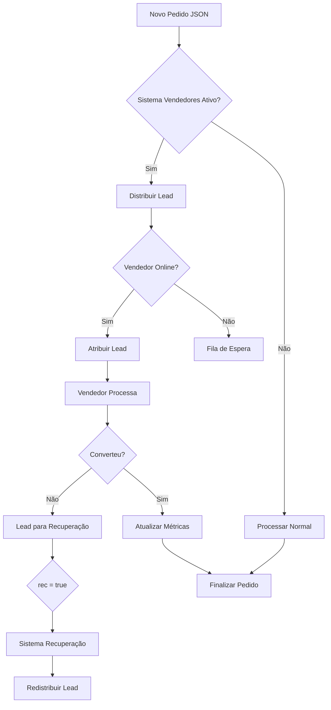

# 👥 LÓGICA COMPLETA DO SISTEMA DE VENDEDORES - DASHBOARD 4LIFE
## Guia para IA Lovable - Implementação do Sistema de Admin de Vendas

---

## 🎯 **VISÃO GERAL DO SISTEMA DE VENDEDORES**

O Sistema de Vendedores é uma **extensão estratégica** do Dashboard 4Life que permite **gerenciar uma equipe de vendas**, **distribuir leads automaticamente** e **monitorar performance individual**. Este sistema integra perfeitamente com os sistemas existentes de **Pedidos** e **Recuperação**, criando um ecossistema completo de gestão de vendas.

### **Objetivos Principais**
- **Cadastrar e gerenciar vendedores** com login próprio
- **Distribuir leads automaticamente** baseado em disponibilidade e proporção
- **Monitorar performance** individual de cada vendedor
- **Rastrear tempo online/offline** de cada vendedor
- **Calcular métricas de conversão** e produtividade
- **Integrar com sistemas existentes** de pedidos e recuperação

---

## 🧬 **ESTRUTURA DE DADOS FUNDAMENTAL - SUPABASE**

### **1. Tabela: `vendedores` (Supabase)**
```sql
-- Criar via Supabase Dashboard ou SQL Editor
CREATE TABLE vendedores (
    id UUID PRIMARY KEY DEFAULT gen_random_uuid(),
    nome TEXT NOT NULL,
    cpf TEXT UNIQUE NOT NULL,
    telefone TEXT NOT NULL,
    email TEXT UNIQUE,
    login TEXT UNIQUE NOT NULL,
    senha TEXT NOT NULL, -- Hash bcrypt
    
    -- Status e controle
    ativo BOOLEAN DEFAULT TRUE,
    online BOOLEAN DEFAULT FALSE,
    ultima_atividade TIMESTAMPTZ DEFAULT NOW(),
    created_at TIMESTAMPTZ DEFAULT NOW(),
    
    -- Configurações de distribuição
    proporcao_leads DECIMAL(5,2) DEFAULT 1.00, -- 1.00 = 100%
    recebe_leads BOOLEAN DEFAULT TRUE,
    
    -- Métricas acumuladas
    total_leads_recebidos INTEGER DEFAULT 0,
    total_pedidos_processados INTEGER DEFAULT 0,
    total_vendas_convertidas INTEGER DEFAULT 0,
    valor_total_vendas DECIMAL(10,2) DEFAULT 0.00,
    
    -- Timestamps de controle
    updated_at TIMESTAMPTZ DEFAULT NOW()
);

-- Índices para performance
CREATE INDEX idx_vendedores_login ON vendedores(login);
CREATE INDEX idx_vendedores_cpf ON vendedores(cpf);
CREATE INDEX idx_vendedores_ativo_online ON vendedores(ativo, online);
CREATE INDEX idx_vendedores_proporcao ON vendedores(proporcao_leads);

-- RLS (Row Level Security) - Configurar no Supabase Dashboard
ALTER TABLE vendedores ENABLE ROW LEVEL SECURITY;

-- Política de acesso (apenas admins podem ver todos os vendedores)
CREATE POLICY "Admins can manage vendedores" ON vendedores
    FOR ALL USING (auth.jwt() ->> 'role' = 'admin');

-- Trigger para updated_at
CREATE OR REPLACE FUNCTION update_updated_at_column()
RETURNS TRIGGER AS $$
BEGIN
    NEW.updated_at = NOW();
    RETURN NEW;
END;
$$ language 'plpgsql';

CREATE TRIGGER update_vendedores_updated_at 
    BEFORE UPDATE ON vendedores 
    FOR EACH ROW EXECUTE FUNCTION update_updated_at_column();
```

### **2. Tabela: `vendedor_sessoes` (Supabase)**
```sql
CREATE TABLE vendedor_sessoes (
    id UUID PRIMARY KEY DEFAULT gen_random_uuid(),
    vendedor_id UUID NOT NULL REFERENCES vendedores(id) ON DELETE CASCADE,
    data_inicio TIMESTAMPTZ DEFAULT NOW(),
    data_fim TIMESTAMPTZ NULL,
    tempo_online_segundos INTEGER DEFAULT 0,
    leads_recebidos_sessao INTEGER DEFAULT 0,
    pedidos_processados_sessao INTEGER DEFAULT 0,
    created_at TIMESTAMPTZ DEFAULT NOW()
);

-- Índices
CREATE INDEX idx_vendedor_sessoes_vendedor_id ON vendedor_sessoes(vendedor_id);
CREATE INDEX idx_vendedor_sessoes_data_inicio ON vendedor_sessoes(data_inicio);
CREATE INDEX idx_vendedor_sessoes_ativo ON vendedor_sessoes(vendedor_id, data_inicio) WHERE data_fim IS NULL;

-- RLS
ALTER TABLE vendedor_sessoes ENABLE ROW LEVEL SECURITY;
CREATE POLICY "Vendedores can manage their sessions" ON vendedor_sessoes
    FOR ALL USING (
        auth.jwt() ->> 'role' = 'admin' OR 
        vendedor_id = (auth.jwt() ->> 'vendedor_id')::uuid
    );
```

### **3. Tabela: `lead_distribuicoes` (Supabase)**
```sql
CREATE TABLE lead_distribuicoes (
    id UUID PRIMARY KEY DEFAULT gen_random_uuid(),
    pedido_id TEXT NOT NULL, -- ID do pedido original
    pedido_arquivo TEXT, -- Nome do arquivo JSON (compatibilidade)
    vendedor_id UUID NOT NULL REFERENCES vendedores(id) ON DELETE CASCADE,
    
    -- Dados do lead
    tipo_lead TEXT CHECK (tipo_lead IN ('pedido_normal', 'recuperacao')) DEFAULT 'pedido_normal',
    valor_lead DECIMAL(10,2) DEFAULT 0.00,
    status_lead TEXT CHECK (status_lead IN ('atribuido', 'em_andamento', 'convertido', 'perdido')) DEFAULT 'atribuido',
    
    -- Timestamps
    data_atribuicao TIMESTAMPTZ DEFAULT NOW(),
    data_inicio_processamento TIMESTAMPTZ NULL,
    data_conclusao TIMESTAMPTZ NULL,
    
    -- Resultado
    convertido BOOLEAN DEFAULT FALSE,
    valor_convertido DECIMAL(10,2) DEFAULT 0.00,
    observacoes TEXT,
    
    created_at TIMESTAMPTZ DEFAULT NOW(),
    updated_at TIMESTAMPTZ DEFAULT NOW()
);

-- Índices para performance
CREATE INDEX idx_lead_distribuicoes_vendedor_id ON lead_distribuicoes(vendedor_id);
CREATE INDEX idx_lead_distribuicoes_pedido_id ON lead_distribuicoes(pedido_id);
CREATE INDEX idx_lead_distribuicoes_status ON lead_distribuicoes(status_lead);
CREATE INDEX idx_lead_distribuicoes_data ON lead_distribuicoes(data_atribuicao);
CREATE INDEX idx_lead_distribuicoes_tipo ON lead_distribuicoes(tipo_lead);

-- RLS
ALTER TABLE lead_distribuicoes ENABLE ROW LEVEL SECURITY;
CREATE POLICY "Vendedores can manage their leads" ON lead_distribuicoes
    FOR ALL USING (
        auth.jwt() ->> 'role' = 'admin' OR 
        vendedor_id = (auth.jwt() ->> 'vendedor_id')::uuid
    );

-- Trigger para updated_at
CREATE TRIGGER update_lead_distribuicoes_updated_at 
    BEFORE UPDATE ON lead_distribuicoes 
    FOR EACH ROW EXECUTE FUNCTION update_updated_at_column();
```

### **4. Extensão na Tabela `pedidos` Existente (Supabase)**
```sql
-- Adicionar colunas à tabela pedidos existente
ALTER TABLE pedidos ADD COLUMN IF NOT EXISTS vendedor_atribuido_id UUID REFERENCES vendedores(id) ON DELETE SET NULL;
ALTER TABLE pedidos ADD COLUMN IF NOT EXISTS data_atribuicao_vendedor TIMESTAMPTZ;
ALTER TABLE pedidos ADD COLUMN IF NOT EXISTS status_vendedor TEXT CHECK (status_vendedor IN ('pendente', 'atribuido', 'em_andamento', 'finalizado')) DEFAULT 'pendente';

-- Índices para performance
CREATE INDEX IF NOT EXISTS idx_pedidos_vendedor_atribuido ON pedidos(vendedor_atribuido_id);
CREATE INDEX IF NOT EXISTS idx_pedidos_status_vendedor ON pedidos(status_vendedor);
CREATE INDEX IF NOT EXISTS idx_pedidos_vendedor_data ON pedidos(vendedor_atribuido_id, data_atribuicao_vendedor);
```

### **5. Configuração de Types (TypeScript) para Supabase**
```typescript
// types/supabase.ts
export interface Database {
  public: {
    Tables: {
      vendedores: {
        Row: {
          id: string
          nome: string
          cpf: string
          telefone: string
          email: string | null
          login: string
          senha: string
          ativo: boolean
          online: boolean
          ultima_atividade: string
          created_at: string
          proporcao_leads: number
          recebe_leads: boolean
          total_leads_recebidos: number
          total_pedidos_processados: number
          total_vendas_convertidas: number
          valor_total_vendas: number
          updated_at: string
        }
        Insert: {
          id?: string
          nome: string
          cpf: string
          telefone: string
          email?: string | null
          login: string
          senha: string
          ativo?: boolean
          online?: boolean
          ultima_atividade?: string
          created_at?: string
          proporcao_leads?: number
          recebe_leads?: boolean
          total_leads_recebidos?: number
          total_pedidos_processados?: number
          total_vendas_convertidas?: number
          valor_total_vendas?: number
          updated_at?: string
        }
        Update: {
          id?: string
          nome?: string
          cpf?: string
          telefone?: string
          email?: string | null
          login?: string
          senha?: string
          ativo?: boolean
          online?: boolean
          ultima_atividade?: string
          created_at?: string
          proporcao_leads?: number
          recebe_leads?: boolean
          total_leads_recebidos?: number
          total_pedidos_processados?: number
          total_vendas_convertidas?: number
          valor_total_vendas?: number
          updated_at?: string
        }
      }
      vendedor_sessoes: {
        Row: {
          id: string
          vendedor_id: string
          data_inicio: string
          data_fim: string | null
          tempo_online_segundos: number
          leads_recebidos_sessao: number
          pedidos_processados_sessao: number
          created_at: string
        }
        Insert: {
          id?: string
          vendedor_id: string
          data_inicio?: string
          data_fim?: string | null
          tempo_online_segundos?: number
          leads_recebidos_sessao?: number
          pedidos_processados_sessao?: number
          created_at?: string
        }
        Update: {
          id?: string
          vendedor_id?: string
          data_inicio?: string
          data_fim?: string | null
          tempo_online_segundos?: number
          leads_recebidos_sessao?: number
          pedidos_processados_sessao?: number
          created_at?: string
        }
      }
      lead_distribuicoes: {
        Row: {
          id: string
          pedido_id: string
          pedido_arquivo: string | null
          vendedor_id: string
          tipo_lead: string
          valor_lead: number
          status_lead: string
          data_atribuicao: string
          data_inicio_processamento: string | null
          data_conclusao: string | null
          convertido: boolean
          valor_convertido: number
          observacoes: string | null
          created_at: string
          updated_at: string
        }
        Insert: {
          id?: string
          pedido_id: string
          pedido_arquivo?: string | null
          vendedor_id: string
          tipo_lead?: string
          valor_lead?: number
          status_lead?: string
          data_atribuicao?: string
          data_inicio_processamento?: string | null
          data_conclusao?: string | null
          convertido?: boolean
          valor_convertido?: number
          observacoes?: string | null
          created_at?: string
          updated_at?: string
        }
        Update: {
          id?: string
          pedido_id?: string
          pedido_arquivo?: string | null
          vendedor_id?: string
          tipo_lead?: string
          valor_lead?: number
          status_lead?: string
          data_atribuicao?: string
          data_inicio_processamento?: string | null
          data_conclusao?: string | null
          convertido?: boolean
          valor_convertido?: number
          observacoes?: string | null
          created_at?: string
          updated_at?: string
        }
      }
    }
  }
}

---

## ⚙️ **FUNÇÕES PRINCIPAIS DO SISTEMA**

### **1. Função: Cadastrar Vendedor - SUPABASE**

**Propósito**: Criar novo vendedor com login no sistema usando Supabase
**Local**: `lib/supabase/vendedores.js`

```javascript
// lib/supabase/vendedores.js
import { supabase } from './client'
import bcrypt from 'bcryptjs'

export async function cadastrarVendedor(dados) {
  try {
    // Validar dados obrigatórios
    const camposObrigatorios = ['nome', 'cpf', 'telefone', 'login', 'senha']
    for (const campo of camposObrigatorios) {
      if (!dados[campo]) {
        throw new Error(`Campo ${campo} é obrigatório`)
      }
    }
    
    // Validar CPF único
    const { data: cpfExiste } = await supabase
      .from('vendedores')
      .select('id')
      .eq('cpf', dados.cpf)
      .single()
    
    if (cpfExiste) {
      throw new Error('CPF já cadastrado')
    }
    
    // Validar login único
    const { data: loginExiste } = await supabase
      .from('vendedores')
      .select('id')
      .eq('login', dados.login)
      .single()
    
    if (loginExiste) {
      throw new Error('Login já existe')
    }
    
    // Hash da senha com bcrypt
    const senhaHash = await bcrypt.hash(dados.senha, 10)
    
    // Criar vendedor no Supabase
    const { data: novoVendedor, error: errorVendedor } = await supabase
      .from('vendedores')
      .insert([{
        nome: dados.nome,
        cpf: dados.cpf,
        telefone: dados.telefone,
        email: dados.email || null,
        login: dados.login,
        senha: senhaHash,
        proporcao_leads: dados.proporcao_leads || 1.00,
        ativo: true,
        online: false,
        recebe_leads: true
      }])
      .select()
      .single()
    
    if (errorVendedor) throw errorVendedor
    
    // Criar entrada na tabela usuarios para compatibilidade (se existir)
    const { error: errorUsuario } = await supabase
      .from('usuarios')
      .insert([{
        login: dados.login,
        senha: senhaHash,
        nivel_acesso: 'vendedor',
        vendedor_id: novoVendedor.id
      }])
    
    // Log do erro de usuário mas não falhar (caso tabela não exista)
    if (errorUsuario) {
      console.warn('Aviso: Não foi possível criar entrada na tabela usuarios:', errorUsuario)
    }
    
    return {
      success: true,
      vendedor: novoVendedor,
      message: 'Vendedor cadastrado com sucesso!'
    }
  } catch (error) {
    return {
      success: false,
      error: error.message
    }
  }
}

// Função para autenticar vendedor
export async function autenticarVendedor(login, senha) {
  try {
    const { data: vendedor, error } = await supabase
      .from('vendedores')
      .select('*')
      .eq('login', login)
      .eq('ativo', true)
      .single()
    
    if (error || !vendedor) {
      throw new Error('Login ou senha incorretos')
    }
    
    // Verificar senha
    const senhaValida = await bcrypt.compare(senha, vendedor.senha)
    if (!senhaValida) {
      throw new Error('Login ou senha incorretos')
    }
    
    // Atualizar última atividade
    await supabase
      .from('vendedores')
      .update({ ultima_atividade: new Date().toISOString() })
      .eq('id', vendedor.id)
    
    return {
      success: true,
      vendedor: {
        ...vendedor,
        senha: undefined // Remover senha do retorno
      }
    }
  } catch (error) {
    return {
      success: false,
      error: error.message
    }
  }
}
```

// Função para listar vendedores com métricas
export async function getVendedores(filtros = {}) {
  try {
    let query = supabase
      .from('vendedores')
      .select(`
        *,
        vendedor_sessoes(
          id,
          data_inicio,
          data_fim,
          tempo_online_segundos,
          leads_recebidos_sessao,
          pedidos_processados_sessao
        ),
        lead_distribuicoes(
          id,
          tipo_lead,
          status_lead,
          convertido,
          valor_convertido,
          data_atribuicao
        )
      `)
    
    // Aplicar filtros
    if (filtros.ativo !== undefined) {
      query = query.eq('ativo', filtros.ativo)
    }
    
    if (filtros.online !== undefined) {
      query = query.eq('online', filtros.online)
    }
    
    // Ordenar por nome
    query = query.order('nome', { ascending: true })
    
    const { data, error } = await query
    
    if (error) throw error
    
    // Processar dados com métricas calculadas
    return data.map(vendedor => {
      const hoje = new Date().toISOString().split('T')[0]
      
      // Métricas do dia
      const leadsHoje = vendedor.lead_distribuicoes?.filter(lead => 
        lead.data_atribuicao.startsWith(hoje)
      ).length || 0
      
      const vendasHoje = vendedor.lead_distribuicoes?.filter(lead => 
        lead.data_atribuicao.startsWith(hoje) && lead.convertido
      ).length || 0
      
      // Tempo online hoje
      const sessoesHoje = vendedor.vendedor_sessoes?.filter(sessao => 
        sessao.data_inicio.startsWith(hoje)
      ) || []
      
      const tempoOnlineHoje = sessoesHoje.reduce((total, sessao) => 
        total + (sessao.tempo_online_segundos || 0), 0
      )
      
      return {
        ...vendedor,
        leads_hoje: leadsHoje,
        vendas_hoje: vendasHoje,
        tempo_online_hoje: formatarTempo(tempoOnlineHoje),
        taxa_conversao: vendedor.total_leads_recebidos > 0 
          ? ((vendedor.total_vendas_convertidas / vendedor.total_leads_recebidos) * 100).toFixed(1) + '%'
          : '0%'
      }
    })
  } catch (error) {
    throw new Error('Erro ao carregar vendedores: ' + error.message)
  }
}

// Função utilitária para formatar tempo
function formatarTempo(segundos) {
  const horas = Math.floor(segundos / 3600)
  const minutos = Math.floor((segundos % 3600) / 60)
  return `${horas}h${minutos.toString().padStart(2, '0')}`
}
```

### **2. Função: Distribuir Lead - SUPABASE**

**Propósito**: Distribuir automaticamente leads para vendedores online usando Supabase
**Local**: `lib/supabase/distribuicao.js`

```javascript
// lib/supabase/distribuicao.js
import { supabase } from './client'

export async function distribuirLead(pedidoDados, tipoLead = 'pedido_normal') {
  try {
    // 1. BUSCAR VENDEDORES ELEGÍVEIS
    const { data: vendedoresDisponiveis, error: errorVendedores } = await supabase
      .from('vendedores')
      .select('id, nome, proporcao_leads, total_leads_recebidos')
      .eq('ativo', true)
      .eq('online', true)
      .eq('recebe_leads', true)
      .order('total_leads_recebidos', { ascending: true })
    
    if (errorVendedores) throw errorVendedores
    
    if (!vendedoresDisponiveis || vendedoresDisponiveis.length === 0) {
      throw new Error('Nenhum vendedor online e disponível')
    }
    
    // 2. SELECIONAR VENDEDOR PELA PROPORÇÃO
    const vendedorSelecionado = selecionarVendedorPorProporcao(vendedoresDisponiveis)
    
    // 3. PREPARAR DADOS DO LEAD
    const leadId = pedidoDados.id || pedidoDados.pedido_id || crypto.randomUUID()
    const arquivo = pedidoDados.arquivo || pedidoDados.numero_pedido || ''
    const valor = pedidoDados.valor_final || pedidoDados.VALOR_FINAL || 0
    
    // 4. CRIAR DISTRIBUIÇÃO DO LEAD (Transação)
    const { data: novaDistribuicao, error: errorDistribuicao } = await supabase
      .from('lead_distribuicoes')
      .insert([{
        pedido_id: leadId,
        pedido_arquivo: arquivo,
        vendedor_id: vendedorSelecionado.id,
        tipo_lead: tipoLead,
        valor_lead: valor,
        status_lead: 'atribuido'
      }])
      .select()
      .single()
    
    if (errorDistribuicao) throw errorDistribuicao
    
    // 5. ATUALIZAR CONTADOR DO VENDEDOR
    const { error: errorUpdate } = await supabase
      .from('vendedores')
      .update({
        total_leads_recebidos: vendedorSelecionado.total_leads_recebidos + 1,
        ultima_atividade: new Date().toISOString()
      })
      .eq('id', vendedorSelecionado.id)
    
    if (errorUpdate) throw errorUpdate
    
    // 6. ATUALIZAR SESSÃO ATUAL
    await atualizarSessaoVendedor(vendedorSelecionado.id, 'lead_recebido')
    
    // 7. MARCAR PEDIDO COMO ATRIBUÍDO
    if (tipoLead === 'pedido_normal') {
      await marcarPedidoComoAtribuido(leadId, vendedorSelecionado.id)
    } else {
      await marcarRecuperacaoComoAtribuida(leadId, vendedorSelecionado.id)
    }
    
    return {
      success: true,
      vendedor_id: vendedorSelecionado.id,
      vendedor_nome: vendedorSelecionado.nome,
      lead_id: novaDistribuicao.id,
      distribuicao: novaDistribuicao
    }
  } catch (error) {
    return {
      success: false,
      error: error.message
    }
  }
}

function selecionarVendedorPorProporcao(vendedores) {
  // Calcular peso para cada vendedor baseado na proporção vs leads recebidos
  const pesos = []
  let totalPeso = 0
  
  vendedores.forEach(vendedor => {
    // Vendedor com menos leads recebidos relativos à sua proporção tem maior peso
    const leadsEsperados = vendedor.proporcao_leads * 100 // Normalizar
    const leadsRecebidos = vendedor.total_leads_recebidos
    
    // Peso inversamente proporcional aos leads já recebidos
    const peso = Math.max(1, leadsEsperados - leadsRecebidos + 1)
    pesos.push({ vendedor, peso })
    totalPeso += peso
  })
  
  // Seleção aleatória ponderada
  const numeroSorteado = Math.random() * totalPeso
  let pesoAcumulado = 0
  
  for (const item of pesos) {
    pesoAcumulado += item.peso
    if (numeroSorteado <= pesoAcumulado) {
      return item.vendedor
    }
  }
  
  // Fallback: retornar primeiro vendedor
  return vendedores[0]
}

// Função para atualizar sessão do vendedor
async function atualizarSessaoVendedor(vendedorId, acao) {
  try {
    // Buscar sessão ativa
    const { data: sessaoAtiva, error } = await supabase
      .from('vendedor_sessoes')
      .select('*')
      .eq('vendedor_id', vendedorId)
      .is('data_fim', null)
      .order('data_inicio', { ascending: false })
      .limit(1)
      .single()
    
    if (error || !sessaoAtiva) {
      console.warn('Nenhuma sessão ativa encontrada para vendedor:', vendedorId)
      return
    }
    
    let updateData = {}
    
    switch (acao) {
      case 'lead_recebido':
        updateData.leads_recebidos_sessao = (sessaoAtiva.leads_recebidos_sessao || 0) + 1
        break
      case 'pedido_processado':
        updateData.pedidos_processados_sessao = (sessaoAtiva.pedidos_processados_sessao || 0) + 1
        break
    }
    
    if (Object.keys(updateData).length > 0) {
      await supabase
        .from('vendedor_sessoes')
        .update(updateData)
        .eq('id', sessaoAtiva.id)
    }
  } catch (error) {
    console.error('Erro ao atualizar sessão do vendedor:', error)
  }
}

// Função para marcar pedido como atribuído
async function marcarPedidoComoAtribuido(pedidoId, vendedorId) {
  try {
    await supabase
      .from('pedidos')
      .update({
        vendedor_atribuido_id: vendedorId,
        data_atribuicao_vendedor: new Date().toISOString(),
        status_vendedor: 'atribuido'
      })
      .eq('id', pedidoId)
  } catch (error) {
    console.error('Erro ao marcar pedido como atribuído:', error)
  }
}

// Função para marcar recuperação como atribuída
async function marcarRecuperacaoComoAtribuida(pedidoId, vendedorId) {
  try {
    // Atualizar pedido de recuperação (rec=true)
    await supabase
      .from('pedidos')
      .update({
        vendedor_atribuido_id: vendedorId,
        data_atribuicao_vendedor: new Date().toISOString(),
        status_vendedor: 'atribuido'
      })
      .eq('id', pedidoId)
      .eq('rec', true)
  } catch (error) {
    console.error('Erro ao marcar recuperação como atribuída:', error)
  }
}
```

### **6. Configuração do Cliente Supabase**

```javascript
// lib/supabase/client.js
import { createClient } from '@supabase/supabase-js'

const supabaseUrl = process.env.NEXT_PUBLIC_SUPABASE_URL
const supabaseAnonKey = process.env.NEXT_PUBLIC_SUPABASE_ANON_KEY

export const supabase = createClient(supabaseUrl, supabaseAnonKey, {
  auth: {
    persistSession: true,
    autoRefreshToken: true,
  },
  realtime: {
    params: {
      eventsPerSecond: 10
    }
  }
})

// Função para verificar se o usuário está autenticado
export async function getCurrentUser() {
  const { data: { user }, error } = await supabase.auth.getUser()
  if (error) throw error
  return user
}

// Função para fazer login com credenciais
export async function signIn(email, password) {
  const { data, error } = await supabase.auth.signInWithPassword({
    email,
    password
  })
  if (error) throw error
  return data
}

// Função para logout
export async function signOut() {
  const { error } = await supabase.auth.signOut()
  if (error) throw error
}
```

### **7. Configuração das Variáveis de Ambiente**

```bash
# .env.local
NEXT_PUBLIC_SUPABASE_URL=https://seu-projeto.supabase.co
NEXT_PUBLIC_SUPABASE_ANON_KEY=sua_anon_key_aqui

# Para desenvolvimento local
SUPABASE_SERVICE_ROLE_KEY=sua_service_role_key_aqui
```

### **3. Função: Controlar Sessão Online/Offline - SUPABASE**

**Propósito**: Gerenciar status online e tempo de trabalho do vendedor usando Supabase
**Local**: `lib/supabase/sessoes.js`

```javascript
// lib/supabase/sessoes.js
import { supabase } from './client'

export async function iniciarSessaoVendedor(vendedorId) {
  try {
    // Verificar se já existe sessão ativa
    const { data: sessaoAtiva, error: errorCheck } = await supabase
      .from('vendedor_sessoes')
      .select('id')
      .eq('vendedor_id', vendedorId)
      .is('data_fim', null)
      .order('data_inicio', { ascending: false })
      .limit(1)
      .single()
    
    // Se não encontrou nenhuma sessão ativa, está OK
    if (errorCheck && errorCheck.code !== 'PGRST116') {
      throw errorCheck
    }
    
    if (sessaoAtiva) {
      return {
        success: false,
        error: 'Vendedor já possui uma sessão ativa'
      }
    }
    
    // Criar nova sessão
    const { data: novaSessao, error: errorSessao } = await supabase
      .from('vendedor_sessoes')
      .insert([{
        vendedor_id: vendedorId,
        data_inicio: new Date().toISOString(),
        tempo_online_segundos: 0,
        leads_recebidos_sessao: 0,
        pedidos_processados_sessao: 0
      }])
      .select()
      .single()
    
    if (errorSessao) throw errorSessao
    
    // Marcar vendedor como online
    const { error: errorOnline } = await supabase
      .from('vendedores')
      .update({
        online: true,
        ultima_atividade: new Date().toISOString()
      })
      .eq('id', vendedorId)
    
    if (errorOnline) throw errorOnline
    
    return {
      success: true,
      sessao: novaSessao,
      message: 'Sessão iniciada com sucesso!'
    }
  } catch (error) {
    return {
      success: false,
      error: error.message
    }
  }
}

export async function finalizarSessaoVendedor(vendedorId) {
  try {
    // Buscar sessão ativa
    const { data: sessaoAtiva, error: errorSessao } = await supabase
      .from('vendedor_sessoes')
      .select('*')
      .eq('vendedor_id', vendedorId)
      .is('data_fim', null)
      .order('data_inicio', { ascending: false })
      .limit(1)
      .single()
    
    if (errorSessao || !sessaoAtiva) {
      return {
        success: false,
        error: 'Nenhuma sessão ativa encontrada'
      }
    }
    
    // Calcular tempo online em segundos
    const dataInicio = new Date(sessaoAtiva.data_inicio)
    const agora = new Date()
    const tempoOnlineSegundos = Math.floor((agora - dataInicio) / 1000)
    
    // Finalizar sessão
    const { error: errorFinalizar } = await supabase
      .from('vendedor_sessoes')
      .update({
        data_fim: agora.toISOString(),
        tempo_online_segundos: tempoOnlineSegundos
      })
      .eq('id', sessaoAtiva.id)
    
    if (errorFinalizar) throw errorFinalizar
    
    // Marcar vendedor como offline
    const { error: errorOffline } = await supabase
      .from('vendedores')
      .update({
        online: false,
        ultima_atividade: agora.toISOString()
      })
      .eq('id', vendedorId)
    
    if (errorOffline) throw errorOffline
    
    return {
      success: true,
      tempo_online_segundos: tempoOnlineSegundos,
      tempo_formatado: formatarTempo(tempoOnlineSegundos),
      sessao_finalizada: {
        ...sessaoAtiva,
        data_fim: agora.toISOString(),
        tempo_online_segundos: tempoOnlineSegundos
      }
    }
  } catch (error) {
    return {
      success: false,
      error: error.message
    }
  }
}

export async function verificarStatusOnline(vendedorId) {
  try {
    const { data: vendedor, error } = await supabase
      .from('vendedores')
      .select('online, ultima_atividade')
      .eq('id', vendedorId)
      .single()
    
    if (error) throw error
    
    // Verificar se há sessão ativa
    const { data: sessaoAtiva } = await supabase
      .from('vendedor_sessoes')
      .select('*')
      .eq('vendedor_id', vendedorId)
      .is('data_fim', null)
      .single()
    
    return {
      success: true,
      online: vendedor.online,
      sessao_ativa: !!sessaoAtiva,
      ultima_atividade: vendedor.ultima_atividade,
      sessao: sessaoAtiva
    }
  } catch (error) {
    return {
      success: false,
      error: error.message
    }
  }
}

export async function obterMetricasSessao(vendedorId, periodo = 'hoje') {
  try {
    let dataInicio
    const agora = new Date()
    
    switch (periodo) {
      case 'hoje':
        dataInicio = new Date(agora.getFullYear(), agora.getMonth(), agora.getDate())
        break
      case 'semana':
        dataInicio = new Date(agora.getTime() - (7 * 24 * 60 * 60 * 1000))
        break
      case 'mes':
        dataInicio = new Date(agora.getFullYear(), agora.getMonth(), 1)
        break
      default:
        dataInicio = new Date(agora.getTime() - (24 * 60 * 60 * 1000))
    }
    
    const { data: sessoes, error } = await supabase
      .from('vendedor_sessoes')
      .select('*')
      .eq('vendedor_id', vendedorId)
      .gte('data_inicio', dataInicio.toISOString())
      .order('data_inicio', { ascending: false })
    
    if (error) throw error
    
    // Calcular métricas
    const totalSessoes = sessoes.length
    const tempoTotalSegundos = sessoes.reduce((total, sessao) => 
      total + (sessao.tempo_online_segundos || 0), 0
    )
    const totalLeads = sessoes.reduce((total, sessao) => 
      total + (sessao.leads_recebidos_sessao || 0), 0
    )
    const totalPedidos = sessoes.reduce((total, sessao) => 
      total + (sessao.pedidos_processados_sessao || 0), 0
    )
    
    return {
      success: true,
      periodo,
      metricas: {
        total_sessoes: totalSessoes,
        tempo_total_segundos: tempoTotalSegundos,
        tempo_total_formatado: formatarTempo(tempoTotalSegundos),
        tempo_medio_sessao: totalSessoes > 0 ? Math.round(tempoTotalSegundos / totalSessoes) : 0,
        total_leads: totalLeads,
        total_pedidos: totalPedidos,
        leads_por_hora: tempoTotalSegundos > 0 ? Math.round((totalLeads * 3600) / tempoTotalSegundos) : 0,
        taxa_conversao_sessao: totalLeads > 0 ? ((totalPedidos / totalLeads) * 100).toFixed(1) : '0'
      },
      sessoes
    }
  } catch (error) {
    return {
      success: false,
      error: error.message
    }
  }
}

// Função para auto-logout por inatividade (executar periodicamente)
export async function verificarInatividade(minutosInatividade = 30) {
  try {
    const tempoLimite = new Date(Date.now() - (minutosInatividade * 60 * 1000))
    
    // Buscar vendedores online há mais tempo que o limite
    const { data: vendedoresInativos, error } = await supabase
      .from('vendedores')
      .select('id, nome, ultima_atividade')
      .eq('online', true)
      .lt('ultima_atividade', tempoLimite.toISOString())
    
    if (error) throw error
    
    // Desconectar vendedores inativos
    const resultados = []
    for (const vendedor of vendedoresInativos) {
      const resultado = await finalizarSessaoVendedor(vendedor.id)
      resultados.push({
        vendedor_id: vendedor.id,
        nome: vendedor.nome,
        ...resultado
      })
    }
    
    return {
      success: true,
      vendedores_desconectados: resultados.length,
      detalhes: resultados
    }
  } catch (error) {
    return {
      success: false,
      error: error.message
    }
  }
}

// Função utilitária para formatar tempo
function formatarTempo(segundos) {
  const horas = Math.floor(segundos / 3600)
  const minutos = Math.floor((segundos % 3600) / 60)
  const segs = segundos % 60
  
  if (horas > 0) {
    return `${horas}h${minutos.toString().padStart(2, '0')}m`
  } else if (minutos > 0) {
    return `${minutos}m${segs.toString().padStart(2, '0')}s`
  } else {
    return `${segs}s`
  }
}
```

---

## 🔄 **INTEGRAÇÃO COM SISTEMAS EXISTENTES - SUPABASE**

### **1. Integração com Sistema de Pedidos - SUPABASE**

**Modificações no processamento de pedidos para incluir distribuição:**

```php
// Adicionar ao final do arquivo processar_pedido.php
function integrarComSistemaVendedores($pedido_dados, $arquivo) {
    // Verificar se sistema de vendedores está ativo
    if (!defined('SISTEMA_VENDEDORES_ATIVO') || !SISTEMA_VENDEDORES_ATIVO) {
        return ['success' => true, 'message' => 'Sistema de vendedores não está ativo'];
    }
    
    // Distribuir apenas pedidos novos (não processados)
    if (isset($pedido_dados['status']) && $pedido_dados['status'] === 'aguardando') {
        return distribuirLead($pedido_dados, 'pedido_normal');
    }
    
    return ['success' => true, 'message' => 'Pedido não precisa ser distribuído'];
}

// Chamar no final do processamento do pedido
$resultado_vendedores = integrarComSistemaVendedores($dados_pedido, $arquivo);
if (!$resultado_vendedores['success']) {
    error_log('Erro na integração com vendedores: ' . $resultado_vendedores['error']);
}
```

### **2. Integração com Sistema de Recuperação**

**Modificações no sistema de recuperação:**

```php
// Adicionar ao arquivo processar_pedido_recuperacao.php
function integrarRecuperacaoComVendedores($pedido_dados, $arquivo) {
    // Verificar se é um pedido de recuperação válido
    if (isset($pedido_dados['Rec']) && $pedido_dados['Rec'] === true) {
        return distribuirLead($pedido_dados, 'recuperacao');
    }
    
    return ['success' => true, 'message' => 'Não é um pedido de recuperação'];
}
```

### **3. Hook para Novos Pedidos JSON**

**Interceptar novos pedidos que chegam pela pasta 2025/pedidos:**

```php
// Criar arquivo: dashboard/processar_novos_pedidos.php
function processarNovoPedidoJSON($arquivo_json) {
    $pedido_path = '../2025/pedidos/' . $arquivo_json;
    
    if (!file_exists($pedido_path)) {
        return false;
    }
    
    $dados = json_decode(file_get_contents($pedido_path), true);
    if (!$dados) {
        return false;
    }
    
    // Verificar se é pedido novo (ainda não foi distribuído)
    if (!isset($dados['vendedor_atribuido']) || empty($dados['vendedor_atribuido'])) {
        
        // Adicionar arquivo aos dados para referência
        $dados['arquivo'] = $arquivo_json;
        
        // Distribuir lead
        $resultado = distribuirLead($dados, 'pedido_normal');
        
        if ($resultado['success']) {
            // Atualizar o arquivo JSON com informações do vendedor
            $dados['vendedor_atribuido'] = $resultado['vendedor_id'];
            $dados['vendedor_nome'] = $resultado['vendedor_nome'];
            $dados['data_atribuicao'] = date('Y-m-d H:i:s');
            $dados['status_vendedor'] = 'atribuido';
            
            // Salvar alterações
            file_put_contents($pedido_path, json_encode($dados, JSON_PRETTY_PRINT));
            
            error_log('Lead distribuído: ' . $arquivo_json . ' para ' . $resultado['vendedor_nome']);
        }
    }
    
    return true;
}

// Criar watcher para novos arquivos (pode ser executado via cron)
function monitorarNovosPedidos() {
    $pasta_pedidos = '../2025/pedidos/';
    $arquivos = glob($pasta_pedidos . '*.json');
    
    foreach ($arquivos as $arquivo) {
        $nome_arquivo = basename($arquivo);
        
        // Pular index.json
        if ($nome_arquivo === 'index.json') continue;
        
        // Processar arquivo
        processarNovoPedidoJSON($nome_arquivo);
    }
}
```

---

## 🎨 **INTERFACE DO USUÁRIO - ADMIN DE VENDEDORES**

### **1. Card de Vendedor - Componente Principal**

```jsx
// components/VendedorCard.jsx
export default function VendedorCard({ vendedor, onEditar, onToggleStatus, onVerMetricas }) {
  const getStatusColor = (online, ativo) => {
    if (!ativo) return 'bg-gray-100 text-gray-600'
    return online ? 'bg-green-100 text-green-800' : 'bg-yellow-100 text-yellow-800'
  }
  
  const getStatusText = (online, ativo) => {
    if (!ativo) return 'Inativo'
    return online ? 'Online' : 'Offline'
  }
  
  const formatarTaxaConversao = (leads, conversoes) => {
    if (leads === 0) return '0%'
    return ((conversoes / leads) * 100).toFixed(1) + '%'
  }
  
  return (
    <div className="bg-white rounded-lg shadow-md p-6 border-l-4 border-blue-500">
      {/* Header com Status */}
      <div className="flex justify-between items-start mb-4">
        <div>
          <h3 className="text-lg font-semibold text-gray-900">
            {vendedor.nome}
          </h3>
          <p className="text-sm text-gray-500">
            CPF: {vendedor.cpf} • Tel: {vendedor.telefone}
          </p>
        </div>
        <div className="flex items-center gap-2">
          <span className={`px-3 py-1 rounded-full text-sm font-medium ${getStatusColor(vendedor.online, vendedor.ativo)}`}>
            {getStatusText(vendedor.online, vendedor.ativo)}
          </span>
          {vendedor.online && (
            <div className="w-3 h-3 bg-green-500 rounded-full animate-pulse"></div>
          )}
        </div>
      </div>
      
      {/* Métricas do Dia */}
      <div className="grid grid-cols-2 md:grid-cols-4 gap-4 mb-4">
        <div className="text-center">
          <div className="text-2xl font-bold text-blue-600">
            {vendedor.leads_hoje || 0}
          </div>
          <div className="text-xs text-gray-600">Leads Hoje</div>
        </div>
        <div className="text-center">
          <div className="text-2xl font-bold text-green-600">
            {vendedor.vendas_hoje || 0}
          </div>
          <div className="text-xs text-gray-600">Vendas Hoje</div>
        </div>
        <div className="text-center">
          <div className="text-2xl font-bold text-purple-600">
            {formatarTaxaConversao(vendedor.total_leads_recebidos, vendedor.total_vendas_convertidas)}
          </div>
          <div className="text-xs text-gray-600">Taxa Conversão</div>
        </div>
        <div className="text-center">
          <div className="text-2xl font-bold text-orange-600">
            {vendedor.tempo_online_hoje || '0h'}
          </div>
          <div className="text-xs text-gray-600">Tempo Online</div>
        </div>
      </div>
      
      {/* Configurações */}
      <div className="bg-gray-50 rounded-lg p-4 mb-4">
        <div className="flex justify-between items-center mb-2">
          <span className="text-sm font-medium text-gray-700">Proporção de Leads:</span>
          <span className="text-sm text-gray-600">{(vendedor.proporcao_leads * 100).toFixed(0)}%</span>
        </div>
        <div className="flex justify-between items-center">
          <span className="text-sm font-medium text-gray-700">Recebe Leads:</span>
          <span className={`text-sm ${vendedor.recebe_leads ? 'text-green-600' : 'text-red-600'}`}>
            {vendedor.recebe_leads ? 'Sim' : 'Não'}
          </span>
        </div>
      </div>
      
      {/* Estatísticas Totais */}
      <div className="space-y-2 text-sm mb-4">
        <div className="flex justify-between">
          <span className="text-gray-600">Total de Leads:</span>
          <span className="font-medium">{vendedor.total_leads_recebidos}</span>
        </div>
        <div className="flex justify-between">
          <span className="text-gray-600">Total de Vendas:</span>
          <span className="font-medium text-green-600">{vendedor.total_vendas_convertidas}</span>
        </div>
        <div className="flex justify-between">
          <span className="text-gray-600">Valor Total Vendido:</span>
          <span className="font-medium text-green-600">
            R$ {parseFloat(vendedor.valor_total_vendas || 0).toFixed(2)}
          </span>
        </div>
        <div className="flex justify-between">
          <span className="text-gray-600">Última Atividade:</span>
          <span className="text-xs text-gray-500">
            {formatarDataRelativa(vendedor.ultima_atividade)}
          </span>
        </div>
      </div>
      
      {/* Ações */}
      <div className="flex gap-2">
        <button 
          onClick={() => onVerMetricas(vendedor)}
          className="flex-1 bg-blue-600 hover:bg-blue-700 text-white px-3 py-2 rounded text-sm font-medium transition-colors"
        >
          📊 Métricas
        </button>
        <button 
          onClick={() => onEditar(vendedor)}
          className="flex-1 bg-gray-600 hover:bg-gray-700 text-white px-3 py-2 rounded text-sm font-medium transition-colors"
        >
          ✏️ Editar
        </button>
        <button 
          onClick={() => onToggleStatus(vendedor)}
          className={`flex-1 px-3 py-2 rounded text-sm font-medium transition-colors ${
            vendedor.ativo 
              ? 'bg-red-600 hover:bg-red-700 text-white' 
              : 'bg-green-600 hover:bg-green-700 text-white'
          }`}
        >
          {vendedor.ativo ? '❌ Desativar' : '✅ Ativar'}
        </button>
      </div>
    </div>
  )
}
```

### **2. Painel Principal de Admin de Vendedores**

```jsx
// app/admin-vendedores/page.jsx
'use client'
import { useState, useEffect } from 'react'
import { getVendedores, cadastrarVendedor, toggleVendedorStatus } from '@/lib/supabase/vendedores'
import VendedorCard from '@/components/VendedorCard'
import ModalCadastroVendedor from '@/components/ModalCadastroVendedor'
import ModalMetricasVendedor from '@/components/ModalMetricasVendedor'
import { toast } from 'react-hot-toast'

export default function AdminVendedoresPage() {
  const [vendedores, setVendedores] = useState([])
  const [loading, setLoading] = useState(true)
  const [modalCadastro, setModalCadastro] = useState(false)
  const [modalMetricas, setModalMetricas] = useState(false)
  const [vendedorSelecionado, setVendedorSelecionado] = useState(null)
  
  const carregarVendedores = async () => {
    try {
      setLoading(true)
      const dados = await getVendedores()
      setVendedores(dados)
    } catch (error) {
      toast.error('Erro ao carregar vendedores')
    } finally {
      setLoading(false)
    }
  }
  
  useEffect(() => {
    carregarVendedores()
    
    // Atualizar a cada 30 segundos para status online
    const interval = setInterval(carregarVendedores, 30000)
    return () => clearInterval(interval)
  }, [])
  
  const handleCadastrar = async (dados) => {
    try {
      const resultado = await cadastrarVendedor(dados)
      if (resultado.success) {
        toast.success('Vendedor cadastrado com sucesso!')
        setModalCadastro(false)
        carregarVendedores()
      } else {
        toast.error(resultado.error)
      }
    } catch (error) {
      toast.error('Erro ao cadastrar vendedor')
    }
  }
  
  const handleToggleStatus = async (vendedor) => {
    try {
      const acao = vendedor.ativo ? 'desativar' : 'ativar'
      if (!confirm(`Tem certeza que deseja ${acao} ${vendedor.nome}?`)) return
      
      await toggleVendedorStatus(vendedor.id)
      toast.success(`Vendedor ${acao}do com sucesso!`)
      carregarVendedores()
    } catch (error) {
      toast.error('Erro ao alterar status do vendedor')
    }
  }
  
  const handleVerMetricas = (vendedor) => {
    setVendedorSelecionado(vendedor)
    setModalMetricas(true)
  }
  
  // Estatísticas gerais
  const estatisticas = {
    total: vendedores.length,
    online: vendedores.filter(v => v.online).length,
    ativos: vendedores.filter(v => v.ativo).length,
    leadsHoje: vendedores.reduce((acc, v) => acc + (v.leads_hoje || 0), 0),
    vendasHoje: vendedores.reduce((acc, v) => acc + (v.vendas_hoje || 0), 0)
  }
  
  if (loading) return <Loading />
  
  return (
    <div className="space-y-6">
      {/* Header */}
      <div className="flex justify-between items-center">
        <div>
          <h1 className="text-2xl font-bold text-gray-900">Admin de Vendedores</h1>
          <p className="text-gray-600">
            Gerencie sua equipe de vendas e monitore performance
          </p>
        </div>
        
        <button 
          onClick={() => setModalCadastro(true)}
          className="bg-blue-600 hover:bg-blue-700 text-white px-4 py-2 rounded-lg font-medium"
        >
          👤 Novo Vendedor
        </button>
      </div>
      
      {/* Estatísticas Gerais */}
      <div className="grid grid-cols-1 md:grid-cols-5 gap-4">
        <div className="bg-white p-4 rounded-lg shadow-sm text-center">
          <div className="text-2xl font-bold text-gray-900">{estatisticas.total}</div>
          <div className="text-sm text-gray-600">Total de Vendedores</div>
        </div>
        <div className="bg-white p-4 rounded-lg shadow-sm text-center">
          <div className="text-2xl font-bold text-green-600">{estatisticas.online}</div>
          <div className="text-sm text-gray-600">Online Agora</div>
        </div>
        <div className="bg-white p-4 rounded-lg shadow-sm text-center">
          <div className="text-2xl font-bold text-blue-600">{estatisticas.ativos}</div>
          <div className="text-sm text-gray-600">Vendedores Ativos</div>
        </div>
        <div className="bg-white p-4 rounded-lg shadow-sm text-center">
          <div className="text-2xl font-bold text-purple-600">{estatisticas.leadsHoje}</div>
          <div className="text-sm text-gray-600">Leads Hoje</div>
        </div>
        <div className="bg-white p-4 rounded-lg shadow-sm text-center">
          <div className="text-2xl font-bold text-orange-600">{estatisticas.vendasHoje}</div>
          <div className="text-sm text-gray-600">Vendas Hoje</div>
        </div>
      </div>
      
      {/* Sistema de Distribuição */}
      <div className="bg-white p-6 rounded-lg shadow-sm">
        <h3 className="text-lg font-medium mb-4">Sistema de Distribuição de Leads</h3>
        <div className="grid grid-cols-1 md:grid-cols-3 gap-4">
          <div className="text-center">
            <div className="text-lg font-bold text-blue-600">Automática</div>
            <div className="text-sm text-gray-600">Distribuição por proporção</div>
          </div>
          <div className="text-center">
            <div className="text-lg font-bold text-green-600">Online</div>
            <div className="text-sm text-gray-600">Apenas vendedores online</div>
          </div>
          <div className="text-center">
            <div className="text-lg font-bold text-purple-600">Equilibrada</div>
            <div className="text-sm text-gray-600">Baseada na performance</div>
          </div>
        </div>
      </div>
      
      {/* Lista de Vendedores */}
      <div className="grid gap-6">
        {vendedores.length === 0 ? (
          <div className="text-center py-12">
            <div className="text-6xl mb-4">👥</div>
            <h3 className="text-lg font-medium text-gray-900 mb-2">
              Nenhum vendedor cadastrado
            </h3>
            <p className="text-gray-600 mb-4">
              Cadastre vendedores para começar a distribuir leads automaticamente.
            </p>
            <button 
              onClick={() => setModalCadastro(true)}
              className="bg-blue-600 hover:bg-blue-700 text-white px-4 py-2 rounded-lg font-medium"
            >
              Cadastrar Primeiro Vendedor
            </button>
          </div>
        ) : (
          vendedores.map(vendedor => (
            <VendedorCard
              key={vendedor.id}
              vendedor={vendedor}
              onEditar={() => {/* Implementar modal de edição */}}
              onToggleStatus={handleToggleStatus}
              onVerMetricas={handleVerMetricas}
            />
          ))
        )}
      </div>
      
      {/* Modais */}
      {modalCadastro && (
        <ModalCadastroVendedor
          onClose={() => setModalCadastro(false)}
          onSubmit={handleCadastrar}
        />
      )}
      
      {modalMetricas && vendedorSelecionado && (
        <ModalMetricasVendedor
          vendedor={vendedorSelecionado}
          onClose={() => setModalMetricas(false)}
        />
      )}
    </div>
  )
}
```

---

## 📊 **SISTEMA DE MÉTRICAS E RELATÓRIOS**

### **1. Função: Calcular Métricas do Vendedor**

```php
function calcularMetricasVendedor($vendedor_id, $data_inicio = null, $data_fim = null) {
    $conn = conectarBD();
    
    // Definir período padrão (último mês)
    if (!$data_inicio) $data_inicio = date('Y-m-01'); // Primeiro dia do mês atual
    if (!$data_fim) $data_fim = date('Y-m-d 23:59:59'); // Hoje
    
    // 1. MÉTRICAS DE LEADS
    $sql_leads = "SELECT 
                    COUNT(*) as total_leads,
                    SUM(CASE WHEN convertido = 1 THEN 1 ELSE 0 END) as leads_convertidos,
                    SUM(valor_convertido) as valor_total_convertido,
                    AVG(valor_lead) as valor_medio_lead
                  FROM lead_distribuicoes 
                  WHERE vendedor_id = ? 
                    AND data_atribuicao BETWEEN ? AND ?";
    
    $stmt = $conn->prepare($sql_leads);
    $stmt->bind_param("iss", $vendedor_id, $data_inicio, $data_fim);
    $stmt->execute();
    $metricas_leads = $stmt->get_result()->fetch_assoc();
    
    // 2. MÉTRICAS DE TEMPO
    $sql_tempo = "SELECT 
                    COUNT(*) as total_sessoes,
                    SUM(tempo_online_segundos) as tempo_total_online,
                    AVG(tempo_online_segundos) as tempo_medio_sessao,
                    SUM(leads_recebidos_sessao) as leads_por_sessao,
                    SUM(pedidos_processados_sessao) as pedidos_por_sessao
                  FROM vendedor_sessoes 
                  WHERE vendedor_id = ? 
                    AND data_inicio BETWEEN ? AND ?";
    
    $stmt = $conn->prepare($sql_tempo);
    $stmt->bind_param("iss", $vendedor_id, $data_inicio, $data_fim);
    $stmt->execute();
    $metricas_tempo = $stmt->get_result()->fetch_assoc();
    
    // 3. MÉTRICAS POR DIA
    $sql_por_dia = "SELECT 
                      DATE(data_atribuicao) as dia,
                      COUNT(*) as leads_dia,
                      SUM(CASE WHEN convertido = 1 THEN 1 ELSE 0 END) as vendas_dia,
                      SUM(valor_convertido) as valor_dia
                    FROM lead_distribuicoes 
                    WHERE vendedor_id = ? 
                      AND data_atribuicao BETWEEN ? AND ?
                    GROUP BY DATE(data_atribuicao)
                    ORDER BY dia DESC";
    
    $stmt = $conn->prepare($sql_por_dia);
    $stmt->bind_param("iss", $vendedor_id, $data_inicio, $data_fim);
    $stmt->execute();
    $metricas_por_dia = $stmt->get_result()->fetch_all(MYSQLI_ASSOC);
    
    // 4. CALCULAR MÉTRICAS DERIVADAS
    $taxa_conversao = $metricas_leads['total_leads'] > 0 
        ? ($metricas_leads['leads_convertidos'] / $metricas_leads['total_leads']) * 100 
        : 0;
    
    $ticket_medio = $metricas_leads['leads_convertidos'] > 0 
        ? $metricas_leads['valor_total_convertido'] / $metricas_leads['leads_convertidos'] 
        : 0;
    
    $leads_por_hora = $metricas_tempo['tempo_total_online'] > 0 
        ? ($metricas_leads['total_leads'] / ($metricas_tempo['tempo_total_online'] / 3600)) 
        : 0;
    
    return [
        'periodo' => [
            'inicio' => $data_inicio,
            'fim' => $data_fim
        ],
        'leads' => [
            'total' => $metricas_leads['total_leads'],
            'convertidos' => $metricas_leads['leads_convertidos'],
            'taxa_conversao' => round($taxa_conversao, 2),
            'valor_total' => $metricas_leads['valor_total_convertido'],
            'valor_medio_lead' => $metricas_leads['valor_medio_lead'],
            'ticket_medio' => round($ticket_medio, 2)
        ],
        'tempo' => [
            'total_sessoes' => $metricas_tempo['total_sessoes'],
            'tempo_total_segundos' => $metricas_tempo['tempo_total_online'],
            'tempo_total_formatado' => formatarTempo($metricas_tempo['tempo_total_online']),
            'tempo_medio_sessao' => round($metricas_tempo['tempo_medio_sessao'] / 3600, 2), // horas
            'leads_por_hora' => round($leads_por_hora, 2)
        ],
        'performance' => [
            'leads_por_sessao' => $metricas_tempo['leads_por_sessao'],
            'pedidos_por_sessao' => $metricas_tempo['pedidos_por_sessao'],
            'produtividade_score' => calcularScoreProdutividade($taxa_conversao, $leads_por_hora, $ticket_medio)
        ],
        'historico_diario' => $metricas_por_dia
    ];
}

function calcularScoreProdutividade($taxa_conversao, $leads_por_hora, $ticket_medio) {
    // Normalizar métricas para score de 0-10
    $score_conversao = min(10, $taxa_conversao / 5); // 50% = score 10
    $score_velocidade = min(10, $leads_por_hora / 2); // 20 leads/hora = score 10
    $score_ticket = min(10, $ticket_medio / 100); // R$ 1000 ticket = score 10
    
    // Peso das métricas
    $peso_conversao = 0.5;
    $peso_velocidade = 0.3;
    $peso_ticket = 0.2;
    
    $score_final = ($score_conversao * $peso_conversao) + 
                   ($score_velocidade * $peso_velocidade) + 
                   ($score_ticket * $peso_ticket);
    
    return round($score_final, 2);
}
```

---

## 🎯 **PONTOS CRÍTICOS PARA A IA LOVABLE**

### **1. INTEGRAÇÃO OBRIGATÓRIA COM SISTEMAS EXISTENTES**

```javascript
// ❌ ERRO - Implementar vendedores isoladamente
const criarSistemaVendedores = () => {
  // Sistema isolado sem integração
}

// ✅ CORRETO - Integração completa
const integrarSistemaVendedores = () => {
  // 1. Interceptar novos pedidos
  interceptarNovosPedidos()
  
  // 2. Integrar com recuperação
  integrarComRecuperacao()
  
  // 3. Manter compatibilidade com campo 'rec'
  respeitarLogicaRec()
  
  // 4. Atualizar métricas em tempo real
  atualizarMetricasVendedores()
}
```

### **2. DISTRIBUIÇÃO INTELIGENTE DE LEADS**

```javascript
// Sistema de distribuição deve considerar:
const criteriosDistribuicao = {
  // 1. Status online obrigatório
  vendedorOnline: true,
  
  // 2. Proporção configurada
  respeitarProporcao: true,
  
  // 3. Balanceamento automático
  equilibrarCarga: true,
  
  // 4. Prioridade por performance
  considerarPerformance: true
}
```

### **3. COMPATIBILIDADE COM ESTRUTURA EXISTENTE**

```javascript
// SEMPRE manter compatibilidade
const manterCompatibilidade = {
  // 1. Estrutura JSON dos pedidos
  estruturaPedidos: 'Manter formato atual',
  
  // 2. Sistema de autenticação
  loginSistema: 'Usar tabela usuarios existente',
  
  // 3. Níveis de acesso
  niveisAcesso: 'Adicionar "vendedor" aos níveis existentes',
  
  // 4. Lógica REC
  campoRec: 'Preservar lógica de rec=true/false'
}
```

---

## 📋 **CHECKLIST DE IMPLEMENTAÇÃO COMPLETA**

### **Fase 1: Estrutura Base (Prioridade Máxima)**
- [ ] Criar tabelas: vendedores, vendedor_sessoes, lead_distribuicoes
- [ ] Implementar função cadastrarVendedor()
- [ ] Criar sistema de login para vendedores
- [ ] Implementar controle de sessão online/offline
- [ ] Testar distribuição básica de leads

### **Fase 2: Integração com Sistemas Existentes**
- [ ] Integrar com sistema de pedidos (processar_pedido.php)
- [ ] Integrar com sistema de recuperação (processar_pedido_recuperacao.php)
- [ ] Criar interceptador para novos arquivos JSON
- [ ] Implementar atualizações automáticas dos arquivos JSON
- [ ] Testar compatibilidade com campo 'rec'

### **Fase 3: Interface de Administração**
- [ ] Página principal Admin de Vendedores
- [ ] Componente VendedorCard com métricas
- [ ] Modal de cadastro de vendedor
- [ ] Sistema de filtros e busca
- [ ] Dashboard de estatísticas gerais

### **Fase 4: Sistema de Métricas**
- [ ] Implementar cálculo de métricas individuais
- [ ] Criar relatórios de performance
- [ ] Sistema de ranking de vendedores
- [ ] Gráficos de evolução temporal
- [ ] Exportação de dados

### **Fase 5: Automação e Otimização**
- [ ] Sistema automático de distribuição
- [ ] Notificações para vendedores
- [ ] Balanceamento inteligente de carga
- [ ] Métricas de produtividade avançadas
- [ ] Integração com WhatsApp/CRM

---

## 🔗 **SINERGIA COM SISTEMAS EXISTENTES**

### **Fluxo Integrado Completo:**



## 📋 **RESUMO DA ADAPTAÇÃO PARA SUPABASE**

### **🎯 Principais Mudanças do MySQL para Supabase:**

1. **🗄️ Banco de Dados**
   - **Antes**: MySQL com `conectarBD()` 
   - **Agora**: PostgreSQL via Supabase com `supabase` client
   - **UUID**: Todas as tabelas usam UUID em vez de AUTO_INCREMENT
   - **Timestamps**: TIMESTAMPTZ para melhor suporte a timezone

2. **🔐 Autenticação e Segurança**
   - **RLS (Row Level Security)**: Políticas de acesso granular
   - **bcrypt**: Hash de senhas mais seguro que MD5
   - **Auth nativo**: Sistema de autenticação integrado do Supabase

3. **🔄 Funcionalidades Avançadas**
   - **Realtime**: Monitoramento em tempo real de novos pedidos
   - **Triggers**: Atualização automática de `updated_at`
   - **Foreign Keys**: Relacionamentos com CASCADE
   - **TypeScript**: Types gerados automaticamente

4. **📊 Performance e Escalabilidade**
   - **Índices otimizados**: Para consultas rápidas
   - **Connection pooling**: Gerenciado automaticamente
   - **CDN global**: Baixa latência mundial
   - **Backup automático**: Sem configuração adicional

### **🔧 Configuração Necessária no Lovable:**

```bash
# Instalar dependências
npm install @supabase/supabase-js bcryptjs

# Variáveis de ambiente (.env.local)
NEXT_PUBLIC_SUPABASE_URL=https://seu-projeto.supabase.co
NEXT_PUBLIC_SUPABASE_ANON_KEY=sua_anon_key
NEXT_PUBLIC_VENDEDORES_ATIVO=true
```

### **📁 Estrutura de Arquivos Supabase:**

```
lib/
├── supabase/
│   ├── client.js          # Cliente Supabase
│   ├── vendedores.js      # CRUD vendedores
│   ├── distribuicao.js    # Distribuição de leads
│   ├── sessoes.js         # Controle online/offline
│   └── metricas.js        # Cálculos de performance
├── hooks/
│   ├── pedidos.js         # Hooks para pedidos
│   └── recuperacao.js     # Hooks para recuperação
└── types/
    └── supabase.ts        # Types TypeScript
```

### **🎯 Benefícios da Migração:**

- ✅ **Escalabilidade**: Suporta milhares de vendedores simultâneos
- ✅ **Tempo Real**: Distribuição instantânea de leads
- ✅ **Segurança**: RLS + Auth nativo
- ✅ **Performance**: Consultas otimizadas + CDN
- ✅ **Manutenção**: Menos código server-side
- ✅ **Monitoramento**: Dashboard built-in do Supabase
- ✅ **Backup**: Automático e confiável
- ✅ **API**: RESTful + GraphQL automático

---

**🎯 Esta documentação fornece TODA a lógica necessária para que a IA Lovable implemente um sistema completo de vendedores usando SUPABASE como banco de dados oficial, integrando perfeitamente com os sistemas existentes de Pedidos e Recuperação, mantendo total compatibilidade e criando uma solução robusta, escalável e moderna.**